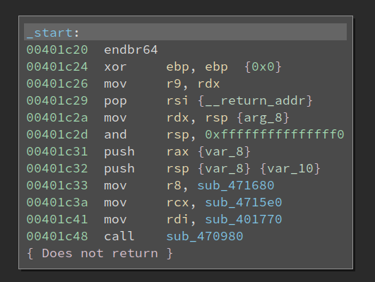
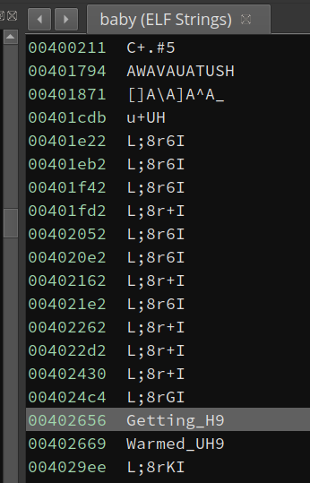
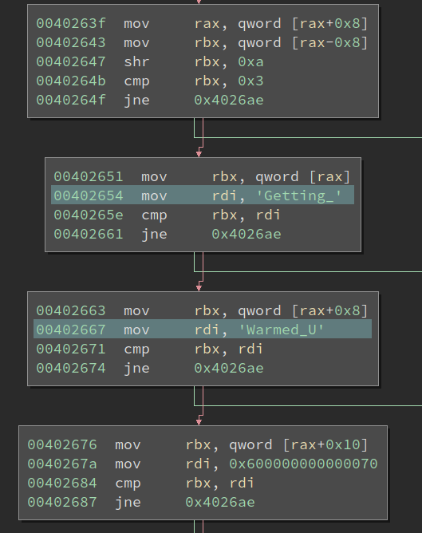
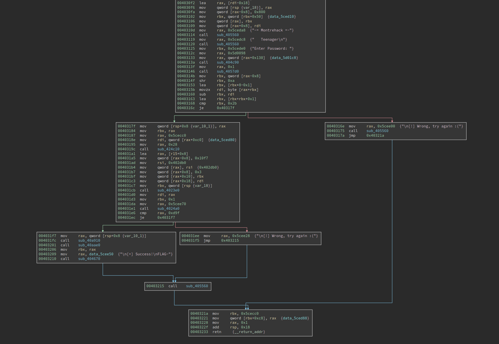
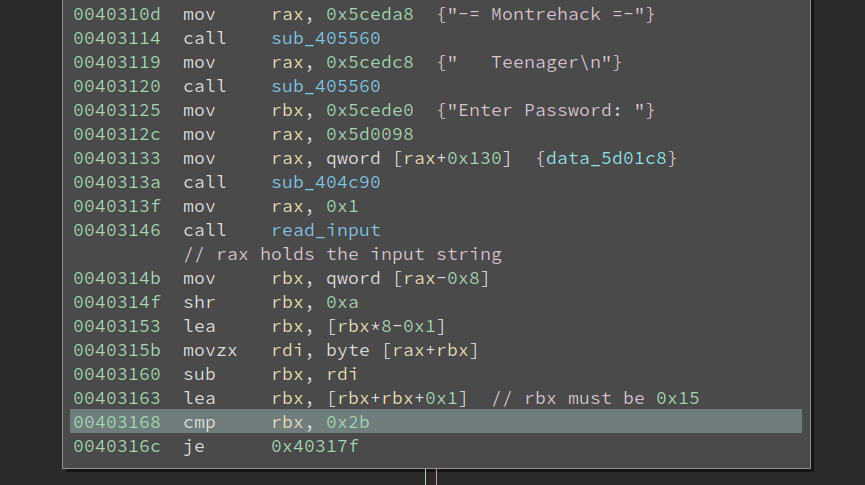
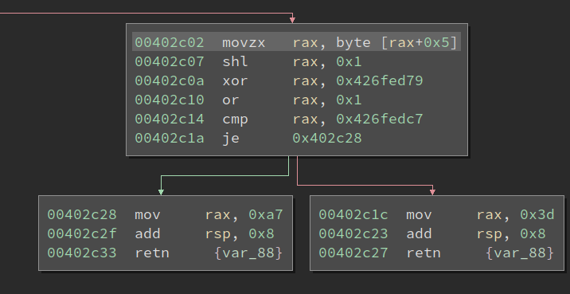
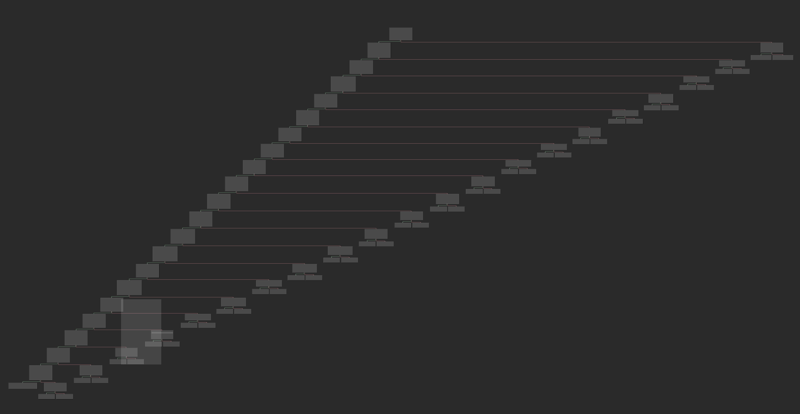
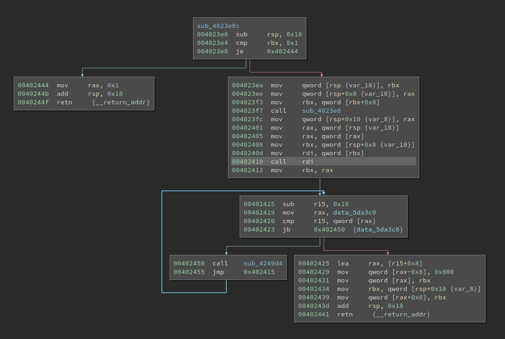
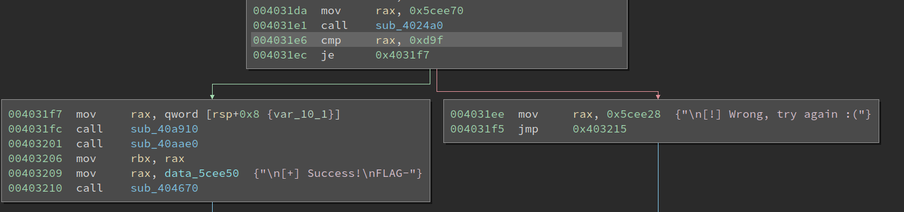
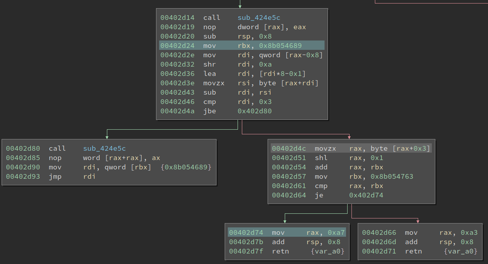

# Solving Two OCaml Crackmes Without Knowing Much about OCaml

Earlier this year, my friend [Towel](https://crackmes.one/user/Towel) uploaded two OCaml crackmes to crackmes.one. One of them is [`Baby OCaml`](https://crackmes.one/crackme/5f600af333c5d4357b3b01d6), and the other one is called [`Teenager OCaml`](https://crackmes.one/crackme/5f600b9933c5d4357b3b01d7). Well, interesting names!

This is not the first time Towel came up with OCaml crackmes. [`Qt Scanner`](https://crackmes.one/crackme/5ec1b82133c5d449d91ae539), rated as level 5, is a hard challenge. I attempted that, but have not succeeded yet. So, when I first saw these two new OCaml challenges, I am not very eager to try them, despite they are rated as level 1 and 3. Nevertheless, we cannot hide from challenges forever, so I decided to try it last week. And the outcome is good, I managed to solve them without digging deep into the OCaml runtime. 

## Baby OCaml

OCaml is an interpretive language, but it can be compiled to native code. This is in contrast to Python/PyInstaller, where the script is just packaged into the generated binary and we can restore the original source of it. The OCaml compiler generates native code based on the source code, and the source is not present within the generated binary. Worse still, when we deal with new programming languages, e.g., OCaml, Go, Rust, we are likely to encounter some novel things we do not expect. For example, Rust has a very different way of passing parameters and return values of a function. We need to first get familiar with it, then start reversing the actual code logic. 

The Baby binary is 2.0 MB in size, which is HUGE for a crackme. The OCaml runtime will occupy lots of space in it, so we need to find the code that we are interested in. Opening the binary in BinaryNinja reveals that it is a statically linked binary:



OK, so even libc functions are not easy to find. But the entry point looks so familiar to me that I can still recognize the `call 0x470980` at 0x401c48 is `libc_start_main`, and `sub_401770` at 0x401c41 is the `main` function. However, the `main` function is mostly initializing the OCaml runtime, and I cannot find the actual entry point to the code. 

Then I decided to run the binary and see if I can get any clue from it:

```Bash
$ ./baby 
-= Montrehack =-
   Baby OCaml

[!] Nope, try again.
```

Ok, it does not ask for input, so the input should probably be supplied as a command line argument. I tried to find the strings it prints but failed. Well, the strings must be encrypted or otherwise obfuscated. Now I cannot quickly find the logic that checks the input, so again this is a dead end. 

I tried to reverse the binary for a half-day but cannot make a breakthrough. The call stack is deep and lots of function pointers are used. I was lost and put the binary aside for a while until one day Towel poked me to try his challenges. I told him that I cannot even solve the baby one, thanks to the string obfuscation. We chatted about the challenges a little bit, and I decided to give it a try again.

This time, I have to admit, that I am super lucky. I browsed the string list and spotted something unusual in the first few:



Looks readable, right? I navigated to the location and the code seems to be comparing strings:



I am pretty sure the code is checking whether the ASCII string at `rax` is `Getting_Warmed_Up`. Note, the last char, `'p'`, with an ASCII value 0x70, is checked against 0x600000000000070. Well, due to little-endian, this will be effectively checking the lowest byte in the qword, but I have no idea what the 0x60 means. So OCaml runtime does have some weird things that are quite unusual. 

Anyways, I solved the challenge:

```Bash
$ ./baby Getting_Warmed_Up
-= Montrehack =-
   Baby OCaml

[+] Success!

FLAG-c34bc2bd73fdb06799061a8e76f62664
```

## Tennager OCaml

Although I did not solve the last challenge decently, I cannot wait to start working on the Teenager one. This binary is 1.9 MB in size. So, yeah, the size is mostly static libraries + OCaml runtime, and the size of the actual logic is almost negligible within it. 

This time it does not use string obfuscation so I can easily locate the place where the binary asks for input:



The control flow seems quite obvious, in the first node it asks for input, there there are two checks, and we must get to the lower left node to pass the check. I was pretty relieved when I saw this since there aren't many functions in this graph. However, it turns out I am naive and too optimistic about it.

The first thing that I cannot understand is.... the first check. 



At 0x403168, `rbx` must be 0x2b, from which we can deduce that `rbx` must be 0x15 at 0x403163. And tracing back, it becomes weird. From debugging I noticed at 0x40314b, `rax` actually holds the ASCII string of the input. What could be located at `rax-0x8`? Well, I am not sure, but it is highly likely to be something related to the string's length. However, reading the code I cannot make any sense of it. I tried inputs with different lengths and the value does not change according to the input length.

Furthermore, at 0x40315b there is a `movzx rdi, byte [rax+rbx]`. We know `rax` is the string, if this is one of the input char, then this check is very strange. The length will be checked against one particular char, and the result must be 0x15.

Luckily, I debugged the code more and find after code at 0x403160, `rbx` always holds the length of the input. So this one is checking whether the string length is 0x15. The OCaml is yet unsolved, but I managed to get some information out of it. 

Now, there are only three functions ahead, but I cannot trace the execution easily. The code uses lots of function pointers and I quickly get lost. A patient reverser would study the OCaml compiler to figure out how the code is generated, but I still have one thing to try: hardware breakpoint on the input string.

The plan is simple, we now know the string is held in `rax` at 0x40314b, then we can set a hardware breakpoint on it and see who accesses it. If everything goes well, we can find the code that reads the input, which is very likely to be also the checking logic code. 

I set a breakpoint at 0x40317f, and supplied the input string "111111111111111111111" (which is just '1' * 0x15). It hits! Not bad, at least we are correct on the length check. The pwndbg shows `rax` does point to the input string:

```Bash
RAX  0x7ffff7ff9b90 ◂— '111111111111111111111'
```

Then I set a hardware read breakpoint:

```Bash
pwndbg> rwatch *0x7ffff7ff9b95
Hardware read watchpoint 3: *0x7ffff7ff9b95
```

Note, the string starts at 0x7ffff7ff9b95, but I set a breakpoint at 0x7ffff7ff9b95, which is the 6th char of the input. This is a personal habit since there could potentially be more places that access the first char than we are interested in. On the other hand, the code that reads a char in the middle is more likely to be interesting and worth checking out. 

The hardware breakpoint is hit at 0x402c07, and the instruction above it is reading the 6th char of the input:



This function (sub_4024f0) looks like:



So it is very likely that the function is checking very char one by one. This function has no xref to it at all, so I probably will not be able to find it easily, if I do not use hardware breakpoint. Inspecting the stack gives me the actual caller, 0x402410, and I have to say it is not easy to find the actual callee without debugging. The good news is if I were to reverse OCaml in the future, I know where to look at and with the help of debugging, I can hopefully find the callee and sort out the execution flow.




I notice if the check passes, the return value is set to 0xa7. Remember the check at 0x4031e6? 0xd9f is quite a strange value, but it could be related to the 0xa7 here. 



```Python
>>> hex(0xd9f/0x15)
'0xa6'
```

So, there is some code, which I have not discovered, that minus 1 from the return value and then sum everything up. Now we know the check for each char, and it should not be hard to dump the constraints and solve it with z3. 

I am lazy and do not wish to manually transcript the constraints and z3 syntax. However, angr does not easily work with it, thanks to the OCaml runtime, which angr does not understand. So I need to combine the power of BinaryNinja API to simplify the binary and enable angr to work with it. 

## Solving with BinaryNinja and Angr



If we look at the basic block at 0x402d4c, there are two inputs to it: 1) the ASCII string in `rax`, 2) the value of `rbx` set at 0x402d24. We also need to extract the char index from the instruction at 0x402d4c (0x3 for in this screenshot). To get the initial value of `rbx`, we do not need to search for the instruction at 0x402d24. Instead, we can use the possible value set of `rbx` to get it. To enable angr, we also need to get the target address of the true/false branch of the conditional at 0x402d64. 

### Getting True/False Branch Address

To get the good/bad branch, we first get the `outgoing_edges` of a basic block and check the `edge.type`:

```Python
bbl = bv.get_basic_blocks_at(addr)[0]
edges = bbl.outgoing_edges
for edge in edges:
    if edge.type == BranchType.TrueBranch:
        good_addr = edge.target.start
    elif edge.type == BranchType.FalseBranch:
        bad_addr = edge.target.start
```

### Parsing LLIL and Getting Char Index

For each constraint, we need to know the index of the char being checked. For example, for instruction `movzx rax, byte [rax+0x3]`, we need to get 0x3 from it. This requires us to walk the LLIL instruction and find its value.

```Python
def find_llil_basic_block(llil_basic_blocks, addr):
    for llil_bbl in llil_basic_blocks:
        if llil_bbl[0].address == addr:
            return llil_bbl

func = bv.get_functions_containing(addr)[0]
llil_basic_blocks = list(func.llil_basic_blocks)
llil_bbl = find_llil_basic_block(llil_basic_blocks, addr)
src = llil_bbl[0].operands[1].operands[0].operands[0]

char_idx = 0
if src.operation == LowLevelILOperation.LLIL_ADD:
    char_idx = src.operands[1].value.value
```

Note, the above code might not be very reader-friendly, e.g., `src = llil_bbl[0].operands[1].operands[0].operands[0]`. This is because LLIL is essentially a tree, and we are travelling down it. 


### Getting the Possible Value of rbx

To get the possible value of rbx when the execution enters the basic block, we need to use the `get_possible_reg_values` API.

```Python
rbx_value = 0
value_set = llil_bbl[0].get_possible_reg_values('rbx')
if value_set.type == RegisterValueType.ConstantValue:
    rbx_value = value_set.value
    rbx_value &= 0xffffffffffffffff
```

Note, not all of the check uses rbx. For them, the `value_set.type` will be `UnderterminedValue`, and rbx_value will remain 0x0. This has no side effect on solving.

### Angr Time

The last step is to solve it with angr:

```Python
def angr_solve(addr, good_addr, bad_addr, char_idx, rbx_value):
    proj = angr.Project('./teenager')
    state = proj.factory.entry_state(addr = addr)
    # suppose the input string (ASCII) is stored at 0xaa000000
    input_addr = 0xaa000000
    state.regs.rax = input_addr
    state.regs.rbx = rbx_value
    flag = state.solver.BVS('flag', 8)
    state.memory.store(input_addr + char_idx, flag)
    simgr = proj.factory.simgr(state)
    simgr.explore(find = good_addr, avoid = [bad_addr])
    if simgr.found:
        solution_state = simgr.found[0]
        char_solution = solution_state.solver.eval(flag, cast_to = bytes)
        return True, char_solution
    else:
        False, None
```

Note, the above script is not super robust, since we really expect the solving to succeed.

We still need to manually collect the 0x15 address of the basic blocks. Although it is possible to automatically collect them, I feel the time to make it work will be longer than just select and copy 0x15 addresses. 

The script returns `0CamL_Ints_Ar3_W4rped`, and feeding it to the challenge gives me:

```Bash
$ ./teenager 
-= Montrehack =-
   Teenager

Enter Password: 0CamL_Ints_Ar3_W4rped

[+] Success!
FLAG-221fddd2bbf810be10d156b060b0eda5
```

This reminds me of the description of the challenge:

```
A slightly harder OCaml challenge to get practice with OCaml integer representations.
```

So, it seems that I solved without knowing anything about OCaml integer representation.