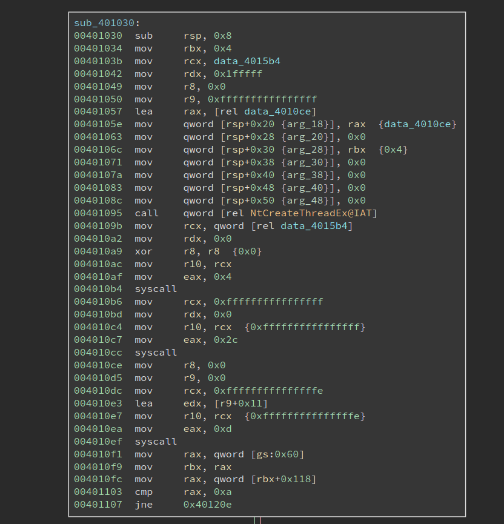
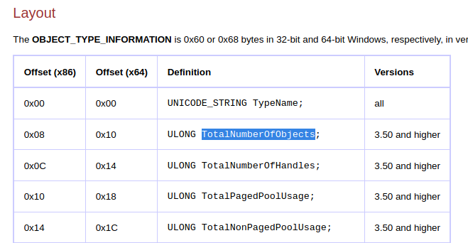

# Deciphering a Windows Anti-debugging Challenge

It has been a long while since I last wrote about anything. We try to post something every week, but it has been, at least for me, super busy recently. So sorry for the gap. The good news is I am going to post several writeups recently. 

This time I am writing about the challenge `ReverseMe3` from `jochen_`. The challenge can be found on [crackmes.one](https://crackmes.one/crackme/5fb1642933c5d424269a1850). The password to unzip is "crackmes.one".

The description given on the challenge page says the program will show a message box when it not running under a debugger. And the goal is to make it also show the message box when it is running under a debugger. Basically, to circumvent the anti-debugging techniques.

Interestingly, the author mentions the program only runs properly on `3 latest builds of Windows 10. 1909 2004 and 20H2`. And if we were to conquer it inside a VM, we have to bypass one more check. So maybe the program uses some new feature that is introduced in the latest versions? Or it might be relying on low-level/un-documented features that only work on these versions. I do not have a VM that has the proper Windows build version, so I decide to solve it statically. 

As always, I will not only explain how to solve it correctly -- I will try to mention many of my thought processes as well as some detours that I have took. I believe this is more interesting to read than a flawless straight-sail. 

## First Impression

The challenge binary `ReverseMe3.EXE` is only 2.6 KB, relatively small. Loading it into BinaryNinja quickly reveals something unusual:


It first sets `eax` to 0x40, `bswap` it, and then calls `cpuid`. the `bswap` will make eax `0x40000000`, and according to my memory that does not return anything useful for `cpuid`. However, at `0x40101d`, the return value in `ecx` is moved into `eax`, which is then used to decrypt the code starting from `0x401030`. The code to be decrypted is 0x258 bytes long. Code at `00401030` immediately follows the decryption loop, and of course, it cannot be properly disassembled since it is still encrypted.

From what I see now the challenge is probably hand-written. I like hand-written challenges since it can be denser in terms of tricks and traps, which is the fun of reverse engineering. 

Note the decryption only uses one byte from the return value of `cpuid`, so it is possible to try all 256 possibilities, disassemble the decrypted code and see which one can be disassembled properly. The same technique is used in one of the crackmes in the book "Reversing: Secrets of Reverse Engineering". 

## CPUID

But we do not have to do the hard work, at least for now. We can see what `cpuid` is returning and decrypt the code with the correct return value. However, as stated in the challenge description, this challenge does not run properly in a VM. And we know that `cpuid` sometimes returns different values inside/outside the VM. So if we actually run the program, we probably get a wrong return value. 

Anyways, let us have a look at of the documentation about `cpuid`. In fact, `eax` register determines the type of information that will be returned by the `cpuid`. For example, if `eax` is zero upon the execution, `cpuid` will return the maximum valid input value for basic CPUID information. Besides, a value that is larger than 0x80000000 will request extended CPUID information. However, these do not help us since the input is 0x40000000. 

In the doc, anything between 0x40000000 - 0x4FFFFFFF is descibed as:

```
Invalid. No existing or future CPU will return processor identification or feature information if the initial EAX value is in the range 40000000H to 4FFFFFFFH.
```

I was tempted to think the return value will be undefined, or even a certain kind of fault will be triggered. However, we see clearly from the code that not only the `cpuid` should execute properly, its return value should be stable. 

Upon closer inspection of the documentation, I find that:

```
If a value is entered for CPUID.EAX is higher than the maximum input value for basic or extended function for that processor then the data for the highest basic information leaf is returned.
```

I am not sure 0x40000000 is greater than 0x80000000 -- maybe they do a signed comparison. Anyways, we know what is going to happen: `the data for the highest basic information leaf is returned.`

Now that we still need to find the concrete return value. I do have a Windows VM, but that gives me 0x56 in `cl`, which after the decryption, gives me garbage rather than valid code. I am not planning to install an actual Windows machine to solve this challenge, so what should I do now?

I soon realize, for things like `cpuid`, it does not matter what OS I run. I am currently on Linux, but the value returned should be the same. I launched [`rappel`](https://github.com/yrp604/rappel), an assembly REPL tool.

```
> mov eax, 0x40000000
> cpuid
rax=00000000000008fc rbx=00000000000012c0 rcx=0000000000000064
rdx=0000000000000000 rsi=0000000000000000 rdi=0000000000000000
rip=0000000000400003 rsp=0000000000000033 rbp=0000000000000000
 r8=0000000000000000  r9=0000000000000000 r10=0000000000000000
r11=0000000000000000 r12=0000000000000000 r13=0000000000000000
r14=0000000000000000 r15=0000000000000000
[cf=0, zf=0, of=0, sf=0, pf=0, af=0, df=0]
cs=002b  ss=0000  ds=0000  es=0000  fs=0000  gs=0000            efl=00000202
```

The return value of `ecx` is 0x64. Is this reliable? Will it always return the same value on different machines? I tried to find the maximum index of the basic information by calling `cpuid` when eax is set to 0:

```
> mov eax, 0
> cpuid
rax=0000000000000016 rbx=00000000756e6547 rcx=000000006c65746e
rdx=0000000049656e69 rsi=0000000000000000 rdi=0000000000000000
rip=0000000000400003 rsp=0000000000000033 rbp=0000000000000000
 r8=0000000000000000  r9=0000000000000000 r10=0000000000000000
r11=0000000000000000 r12=0000000000000000 r13=0000000000000000
r14=0000000000000000 r15=0000000000000000
[cf=0, zf=0, of=0, sf=0, pf=0, af=0, df=0]
cs=002b  ss=0000  ds=0000  es=0000  fs=0000  gs=0000            efl=00000202
```

We can see the return value of eax 9s 0x16, which means the maximum basic information is 0x16. Then I set `eax` to 0x16 and call `cpuid` again:

```
> mov eax, 0x16
> cpuid
rax=00000000000008fc rbx=00000000000012c0 rcx=0000000000000064
rdx=0000000000000000 rsi=0000000000000000 rdi=0000000000000000
rip=0000000000400003 rsp=0000000000000033 rbp=0000000000000000
 r8=0000000000000000  r9=0000000000000000 r10=0000000000000000
r11=0000000000000000 r12=0000000000000000 r13=0000000000000000
r14=0000000000000000 r15=0000000000000000
[cf=0, zf=0, of=0, sf=0, pf=0, af=0, df=0]
cs=002b  ss=0000  ds=0000  es=0000  fs=0000  gs=0000            efl=00000202
```

Not bad, the same output is returned. So I am pretty confident calling `cpuid` with eax set to 0x40000000 has the same effect as calling it with 0x16. Looking for the value 0x16 in the table in Intel docs tells me that it returns `Processor Frequency Information Leaf`. For register `ecx`, it says "Bits 15 - 00: Bus (Reference) Frequency (in MHz)." 

I am not sure whether this information is all the same on different machines since such bus frequency could vary in different cases. Please feel free to get in touch with me if you have any ideas about this! Anyways, if I do install a Windows machine and execute the program, I should get the same output. I proceeded with the value and used it to decrypt the 0x258 bytes of encrypted code, starting at 0x401030. BinaryNinja makes it super easy to transform the code, and the output looks valid:



Before we proceed to analyze the decrypted code, I would like to see what is returned on a VM. I used a similar assembly REPL tool, [WinREPL](https://github.com/zerosum0x0/WinREPL), to checkout the result on Windows:

```
>>> mov eax, 0x40000000
>>> cpuid
assembled (2 bytes): 0f a2
rax: 0000000040000006 rbx: 00000000786f4256 rcx: 00000000786f4256 rdx: 00000000786f4256
r8 : 0000000000000000 r9 : 0000000000000000 r10: 0000000000000000 r11: 0000000000000000
r12: 0000000000000000 r13: 0000000000000000 r14: 0000000000000000 r15: 0000000000000000
rsi: 0000000000000000 rdi: 0000000000000000
rip: 0000023ca56f000e rsp: 000000478b2fef00 rbp: 0000000000000000
flags: 00000200  CF: 0  PF: 0  AF: 0  ZF: 0  SF: 0  DF: 0  OF: 0
```

When we run `cpuid` with `eax` set to 0x40000000, the return value in ecx is actually the string "VBox". I am not entirely sure which basic information it is trying to return, so I set `eax` to 0 to find out:

```
>>> mov eax, 0
>>> cpuid
assembled (2 bytes): 0f a2
rax: 0000000000000016 rbx: 00000000756e6547 rcx: 000000006c65746e rdx: 0000000049656e69
r8 : 0000000000000000 r9 : 0000000000000000 r10: 0000000000000000 r11: 0000000000000000
r12: 0000000000000000 r13: 0000000000000000 r14: 0000000000000000 r15: 0000000000000000
rsi: 0000000000000000 rdi: 0000000000000000
rip: 0000023ca56f0007 rsp: 000000478b2fef00 rbp: 0000000000000000
flags: 00000200  CF: 0  PF: 0  AF: 0  ZF: 0  SF: 0  DF: 0  OF: 0
```

Not bad, it returns the same value when running on a real machine, 0x16. However, when I run `cpuid` with `eax` set to 0x16, I get the surprising output:

```
>>> mov eax, 0x16
>>> cpuid
assembled (2 bytes): 0f a2
rax: 0000000000000000 rbx: 0000000000000000 rcx: 0000000000000000 rdx: 0000000000000000
r8 : 0000000000000000 r9 : 0000000000000000 r10: 0000000000000000 r11: 0000000000000000
r12: 0000000000000000 r13: 0000000000000000 r14: 0000000000000000 r15: 0000000000000000
rsi: 0000000000000000 rdi: 0000000000000000
rip: 0000023ca56f0015 rsp: 000000478b2fef00 rbp: 0000000000000000
flags: 00000200  CF: 0  PF: 0  AF: 0  ZF: 0  SF: 0  DF: 0  OF: 0
```

Then return values are all zero, and they are different from those returned when we set `eax` to 0x40000000. To sum up, the output is wrong in two senses: 1). when we set `eax` to 0x16, it does not return a valid CPUID information; 2). when we set `eax` to 0x40000000, it does not give the same output as if we were running `cpuid` with `eax` set to the maximum index of basic information, in this case, 0x16. So these two are subtle differences between a real machine and a VM, which can be used as VM detection as well.

## Native Syscall on Windows

Now it is time to analyze the decrypted code. Looking at the image above, we notice it first calls `NTCreateThread` to create a thread, whose entry is at 0x4010ce. And it then makes two system calls using the `syscall` instruction. Note the thread entry 0x4010ce is right below the code that makes syscalls, and the two syscalls do not seem to transfer the control to any other places, so it is very likely they are not doing something special. 

But we still need to figure out what the two syscalls are doing. I did not see any challenges using `syscall` on Windows, mostly because the system call index is opaque on Windows, and they can be different across different system versions. Oh, this could be the reason why the author says it only works on specific versions of Windows -- it relies on the specific index of certain system calls.

There are many ways to dump the system call on a Windows system. However, since my Windows VM is having a wrong build version, the system call index I can get is also probably NOT the same as the author expects. So I searched online for a bit and found something already organized the information into a nice searchable table at https://j00ru.vexillium.org/syscalls/nt/64/.


So the first syscall is made with eax = 4, and I found it is `NtWaitForSingleObject`. And the object it waits for happens to be the newly created thread. The next system call is 0x2c, which is `NtTerminateProcess`. So the remaining code just waits for the thread to finish, and terminate the process.

We also see that the index for these two system calls is different on different major Windows versions, e.g., Win7 v.s. Win10, but they remain the same within different Win10 versions. So they do not account for the special requirement for the three Win10 builds.

So now we shift the focus of the analysis to the thread routine, as shown below:


It starts by making a syscall 0xd, which translates to `NtSetInformationThread`, with `r9` set to 0x11, which means `ThreadHideFromDebugger`. This is a common anti-debug technique that tried to hide the thread from the debugger. The thread will continue to execute, but the debugger will no longer be notified by any debug events related to the thread.


Next, it retrieves `PEB` at `gs:0x60`, at checks whether the field at 0x118 is equal to 0xa. Inspecting the structure with windbg shows (some output omitted):

```
lkd> dt _PEB
nt!_PEB
...
   +0x118 OSMajorVersion   : Uint4B
   +0x11c OSMinorVersion   : Uint4B
   +0x120 OSBuildNumber    : Uint2B
...
```

So it is checking whether the OSMajorVersion is 10. Yeah, so it is checking whether this is a Win10.


Moving downward, we see that it is checking OSBuildNumber for a specific value, 0x47bb. I have no idea what it is when I first see it (though there are ways to figure it out). If the version matches, we see it is setting the dword at 0x401149 to be 0xa1. At first, I do not understand it, so I skipped it and moved to analyze the code at 0x401125. 

The next system call it makes is 0xa5. Searching it on the previous webpage gives me an interesting result (the image is cropped to show only the important part): 


We can see on the latest two versions of Win10, i.e., version 2004 and 20H2, system call 0xa5 means `NtCreateDebugObject`. However, on version 1909, 0xa5 means a different system call and `NtCreateDebugObject` is 0xa1. Hmmm, 0xa1, does it look familiar? We have just seen it at address 0x40111e, right? And it is writing to `data_401149`, in the middle of an instruction. I suddenly understand what it is doing: it is patching the instruction at 0x401148 to `"mov eax, 0xa1"`, when the current system has OSBuildNumber 0x47bb. 

Now I am pretty sure 0x47bb means Win10 version 1909. And the code uses a small patching trick to make sure that always calls `NtCreateDebugObject`, even if the system call number varies. Besides, this also explains why the program only works on a very limited number of Win10 builds: the system call number of other Win10 builds are different as well, and there is no code to take care of that.

A careful reader should have noticed that the code should also work on Win10 version 1903, which happens to have the system call number 0xa1 for `NtCreateDebugObject`. The only change needed is to also change the instruction to `"mov eax, 0xa1"` when a Win10 1903 is encountered.

Now, let us get back to the code itself. It is calling `NtCreateDebugObject`, which is likely to be a common anti-debugging technique. Although I know this technique, I cannot remember the details of it. So let me research the code as if it is something new to me. 

The first thing to find out is the definition of the system call, which helps us understand the meaning of its parameters. MS does not document it, but we can still find some clue by searching withing the ReactOS source code:

```C
NTSTATUS
NtCreateDebugObject(
    _Out_ PHANDLE DebugHandle,
    _In_ ACCESS_MASK DesiredAccess,
    _In_ POBJECT_ATTRIBUTES ObjectAttributes,
    _In_ ULONG Flags
);
```

Alternatively, we can always search it with Duckduckgo and this time we will be lucky since `Process Hacker` also uses it: https://processhacker.sourceforge.io/doc/ntdbg_8h.html#aaf201d37b7597c3997ba3380de6253dd.

Among the four parameters, the interesting one is the first one, `DebugHandle`. Note the Windows x64 calling convention passes the first four parameters in the order of `rcx, rdx, r8, r9`. So we know `data_4015ac` is the returned `DebugHandle`. Then the code checks the return value and the system call `NtCreateDebugObject` must have succeeded. 


## Anti-debugging Techniques

The next basic block is longer, which starts with two system calls and also includes a function call. Note the last two instructions, i.e., 

```
push 0x401288
ret
```

will transfer the control flow to 0x401288. The bytes at 0x401288 do not look like valid code yet, so there might be a second round of decryption. Scanning upwards I see at address 0x4011dc, 0x401288 is moved into `rcx`, along with a strange string `"1c4TLKe6Px8M2fN7iAlC"`. sub_401226 is very likely a decryption function! Let us have a look at it first:


It is a rather small and simple function: it uses a string as the key to xor decrypt the given data. The actual xor happens at 0x401256. Its four parameters are:

```
rcx: data to decrypt
rdx: data length
r8:  xor key
r9:  key length
```

Comparing these with the call-site at 0x4011f8, we can know that the data (code) at 0x401288 is 0x143 bytes long, and the xor key is `"1c4TLKe6Px8M2fN7iAlC"`, which is 0x14 bytes long. 

However, if we proceed to decrypt the code, we will get the wrong result. The author sets up another trap here. The xor key string is written to before the decryption. This can be seen in a more obvious way if we define it as a string:


`xor_key[4]` and `xor_key[0x13]` are both changed before the decryption. And the new value is derived from `data_4014b8` and `data_4015bc`, which we need to figure out now. 

`data_4015bc` is easier to figure out, since we get cross reference to it, right in the code above:


It is calling `NtQueryInformationThread` with the second parameter being `ThreadHideFromDebugger` to query whether `ThreadHideFromDebugger` is set. Remember the code at 0x4010ef, which uses `NtSetInformationThread` to set `ThreadHideFromDebugger` to true (0x1)? Here, the code is checking its value. It is trying to verify we do not change the value. Since a common way to circumvent the `ThreadHideFromDebugger` is to skip the `NtQueryInformationThread` call, in which case the thread will not hide from the debugger, but the query result will return false (0x0). Further, the program does not check whether the return value is true or false, rather it uses it as part of the decryption key. Had the program been running outside of a debugger, `data_4015bc` should have value 0x1 at 0x4011b6. If the value is altered, the program will appear to be running fine, but the decrypted code will contain errors. 

This is an aha moment in reversing, and it is one of the reasons I love reversing. Although I do not know the author of the challenge when I reached this point, I enjoy the obstacle he set up here. It even feels that we had a short but pleasant virtual conversation about this challenge.

Also, this reminds me of checking out the implementation of [ScyllaHide](https://github.com/x64dbg/ScyllaHide), the popular anti-anti-debug plugin for x64db, to see if it handles this correctly. Which I will cover at the end of the write-up.

What about `data_4014b8`? There is no xref to it. But it is pretty close to another data variable `data_4014a8`, 


`data_4014a8` is referenced in the remaining system all that we have not analyzed yet:


If `data_4014a8` is a non-trivial structure, then `data_4014b8` is very likely a field inside of it. And its value will be determined by the `NtQueryObject` call. 

`NtQueryObject` happens to be [documented](https://docs.microsoft.com/en-us/windows/win32/api/winternl/nf-winternl-ntqueryobject):

```C
__kernel_entry NTSYSCALLAPI NTSTATUS NtQueryObject(
  HANDLE                   Handle,
  OBJECT_INFORMATION_CLASS ObjectInformationClass,
  PVOID                    ObjectInformation,
  ULONG                    ObjectInformationLength,
  PULONG                   ReturnLength
);
```

`rdx` is `ObjectInformationClass` and its value is 0x2, `r8` holds `ata_401478` and it is the `ObjectInformation` that we are interested in. 

Searching the MSVC headers or ReactOS source gives the following definition for `OBJECT_INFORMATION_CLASS`:

```C
typedef enum _OBJECT_INFORMATION_CLASS {
    ObjectBasicInformation,
    ObjectNameInformation,
    ObjectTypeInformation,
    ObjectAllTypesInformation,
    ObjectHandleInformation
} OBJECT_INFO_CLASS;
```
And 0x2 for `ObjectInformationClass` means `ObjectTypeInformation`. 

The reverse-engineered definition of `OBJECT_TYPE_INFORMATION` can be found at [geoffchappell's site](https://www.geoffchappell.com/studies/windows/km/ntoskrnl/api/ob/obquery/type.htm):



(The screenshot is cut short to save space)

We can do the calculation and find `data_4014a8` is at offset 0x10 into the structure at `data_4014a8`, and the field is `ULONG TotalNumberOfObjects`. What is the `correct` value of `TotalNumberOfObjects`, if the program is not being debugged? Details can be found [here](https://ntquery.wordpress.com/2014/03/30/anti-debug-ntqueryobject/) and it should be 0x1. Now the code looks like this:


And we know both `object_type.TotalNumberOfObjects` and `thread_hide_from_debugger` is 0x1, so we can deduce `xor_key[4]` will be changed to 0x42 ('B'), and `xor_key[0x13]` will be changed to 0x51 ('Q'). And the `xor_key` becomes `"1c4TBKe6Px8M2fN7iAlQ"`. Decrypting 0x143 bytes starting from 0x401288 gives me the following code:


## Resolving DLL Imports with Function Name Hash

The call at 0x40129c and 0x4012b7 looks way too familiar to me. It is finding the address of a particular function inside a DLL. The difference between the ordinary GetProcAddr is that it uses a hash of the function name, rather than the function name itself for the lookup. There is a `uint32_t hash(char* function_name)` that returns a dword as the hash for the function name. And the code walks the export table of the given DLL, calculate the hash of every export function, and see if there is a match. In this example, the two hashes are 0xa216a185 and 0x9a9c4525. 

How do we know which function it tries to find? Well, for this simple example, we can guess from the code that the first one is a `LoadLibraryA`, and the second one is a `MessageBoxA` (from the challenge description). However, if we need to deobfuscate a lot of functions, guessing is not a good idea. 

There are mostly two ways to deal with it. The first one is to run the code, ask itself to find the function, and we just write it down. This is helpful when the number of functions is small, and the code can run properly. If we are analyzing a large binary or a memory dump, then it is not feasible. 

The second way is to reverse engineer the hash function, enumerate the export table of the DLL, and try to find a match by ourselves. 


The function needs to process the PE format so it is not trivial. But there is a shortcut to deal with it. We can see the loop at 0x401372 is operating on a string in `rsi`, and the result is put into `rdi`. At 0x401381, the calculated hash is compared with the `expected_hash`, which is an argument of the function. If they match, the code proceeds to find the address of the function; if they do not match, the code proceeds to the next loop.

So we only need to reverse engineer the loop at 0x401372. A Python equivalent is:

```Python
def rol(val, n):
    bin_str = bin(val)[2:]
    bin_str = '0' * (32 - len(bin_str)) + bin_str
    bin_str = bin_str[n : ] + bin_str[ : n]
    return int(bin_str, 2)

def calc_hash(name):
    val = 0
    for c in name:
        val += ord(c)
        val &= 0xffffffff
        val = rol(val, ord(c) & 31)
    return val

# prints 0xa216a185
print(calc_hash('LoadLibraryA'))
# prints 0x9a9c4525
print(calc_hash('MessageBoxA'))
```

There is one thing worth noting about at 0x401377, the code is `"rol edi, cl"` where the `cl` is the next input char. `cl` can be (and likely is) larger than 31 since it is an ASCII char. However, the `edi` is only 32 bits wide, what would happen? Well, I studied the behavior of this case earlier in another [writeup](https://github.com/jeffli678/writeups/blob/master/shl_undefined_behavior/writeup.md), and the conclusion is:

```
The count is masked to 5 bits (or 6 bits if in 64-bit mode and REX.W is used). The count range is limited to 0 to 31 (or 63 if 64-bit mode and REX.W is used).
```

In other words, only the lowest 5 bits of the input char will be involved in the `rol` operation. And that is also the reason that I wrote `val = rol(val, ord(c) & 31)` in the Python code. 

<!-- Also, at 0x401372, the author uses `lodsb byte [rsi]` without clearing the direction flag in the first place. This is a little bit risky since it could lead to unexpected behavior. If the direction flag is set while executing `lodsb`, `rsi` will be decremented by one every time. Though in reality, most likely the direction flag is cleared without doing anything, it is still better to be cleared for consistency. `cld` instruction will do the trick.  -->

Another interesting thing is the way the author passes the DLL handle. The second handle, i.e. the handle of `user32.dll`, is returned by `LoadLibraryA` so there is nothing special about it. But for the first handle, we can find `LoadLibraryA` from it, which indicates the module must be `kernel32.dll`. How does the author get it? We can see it is passed in by `r15` at 0x401288. Tracing back to the previous function we see `mov r15, qword [rel 0x4015c4]`, and cross-reference of `data_4015c4` brings me back to the very beginning of `_start`:


I noticed this piece of code when I started the journey, but I do not immediately understand it then. But now it is another aha moment! Note this is a hand-written program, so its entry point is where the execution starts. This is different from a compiled program where the `main()` function is called by the C runtime. 

Who calls the entry point? Well, it is somebody inside of the `kernel32.dll`. Then the author clears the `ax`, and subtract 0x10000 from `rax` to get the base of `kernel32.dll`. This is related to memory alignment, the behavior of ASLR, as well as the offset of the callee into the base of the DLL. I am not sure it always works, but it looks fine to me. In the end, the base of `kernel32.dll` is saved into `data_4015c4`. 

Alright, we have deciphered all the secrets of this challenge!

This is a small binary so we can reverse all of the bytes in it. I notice there are some bytes under the `GetProcAddr` function, which looks like this:


The `4883` in the beginning tells me it is probably code, and defining a function there gives me:


Ha, another call to `MessageBoxA`. And this one is calling the one in the IAT table, whereas the real one is dynamically resolved. 

## NtCreateThreadEx and THREAD_CREATE_FLAGS_HIDE_FROM_DEBUGGER

The original challenge asked us to make the program run properly and also pop up a MessageBox even when it runs under a debugger. Since we have analyzed all its tricks, I think it would not be hard at all to do it. To do this, I downloaded the Win10 20H2 ISO and installed a VM.

The first patch needed is to hardcode the return value (0x64) of `cpuid`. I patched the following four instructions:

```
mov eax, 0x40
bswap eax
cpuid
mov eax, ecx
```

to 

```
mov eax, 0x64
```
and copies the patched binary to VM. Now if I double-click it, it does run and the MessageBox pops up:


Not bad, it works!

The next step is to remove the anti-debugging checks. The simplest way is to remove the calls to `NtSetInformationThread`, `NtQueryInformationThread`, `NtCreateDebugObject` and `NtQueryObject`. And hardcode the expected value, or directly change the `xor_key`. However, before I make those patches, I found the breakpoint at 0x4010ce is never triggered. The debuggee simple exits. 

The first mistake I made is using software breakpoint on self-modifying code. We know that software breakpoint works by patching the byte to 0xcc. The debugger internally keeps a list of addresses of software breakpoints and the original byte value so it will still display the old byte value if we display it. However, things get tricky when the code self-modifies. The 0xcc byte will be overwritten by the new byte value, and it is no longer a breakpoint. Now if the execution reaches the address where we put a breakpoint, it will not fire since the actual byte value is NOT 0xcc. If in a good case, another breakpoint hit (or any other debug event happens) and the debugger gets a chance to inspect the list of breakpoints and see one of them is changed from 0xcc to a new different value, then it can reason:

```
Ok, this byte was 0x12, and I changed it to 0xcc. Now it is 0xab.
What happened? It must be the program modifies the byte.
I simply need to restore it to 0xcc, and update the "original value" of this byte to 0xab.
```
If this is the case, the debugger can handle self-modifying code properly. Unfortunately, the case I encounter is the bad case where the modified breakpoint is the one that is expected to fire. So there is no way it works. And the only way is to use a hardware breakpoint (or trace it with single-step). 

Nevertheless, even if I used hardware breakpoint on the thread entry it still does not hit. Later, I found the secret is with `NtCreateThreadEx`. I do not know any anti-debugging tricks with it, so I naively think I can set a breakpoint on the thread entry point and wait there. However, this [blog post](https://ntquery.wordpress.com/2014/03/29/anti-debug-ntcreatethreadex/) explains an anti-debugging with `NtCreateThreadEx`: setting the `CreateFlags` to `THREAD_CREATE_FLAGS_HIDE_FROM_DEBUGGER` (0x4) will also hide the debuggee from the debugger, which has the same effect as calling `NtSetInformationThread` with `ThreadHideFromDebugger`. So no wonder the breakpoint on the thread routine will not hit at all! The thread is hidden from the debugger. 

This is easy to fix once I understand the trick. Since the code is decrypted before it runs, if we were to patch it we need to make sure we patch the encrypted bytes so the decrypted code is what we want. This is possible, especially when the decryption is just xor. However, I am a little bit lazy and I decide to bypass it in a debugger, i.e., change `rbx` back to 0, right after the code set it to 0x4 at 0x401034. Now the breakpoint on the thread entry point hits. 

Then I directly set the `rip` to 0x4011b6:


And manually set the value of `object_type.TotalNumberOfObjects` and `thread_hide_from_debugger` to 1. Then press F9 to run the program, and the MessageBox pops up:


Nice, I have COMPLETELY analyzed the program and explained lots of details in it. I hope you like this write-up! And feel free to get in touch with me if you have any questions or suggestions. 