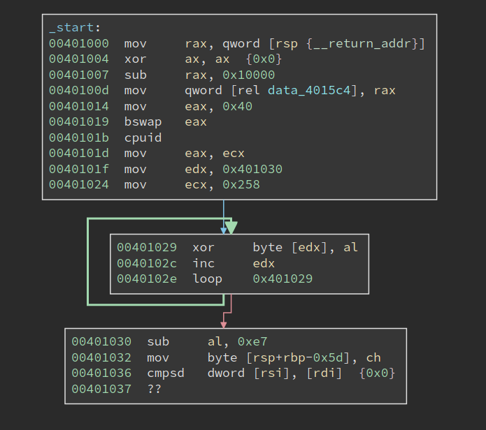
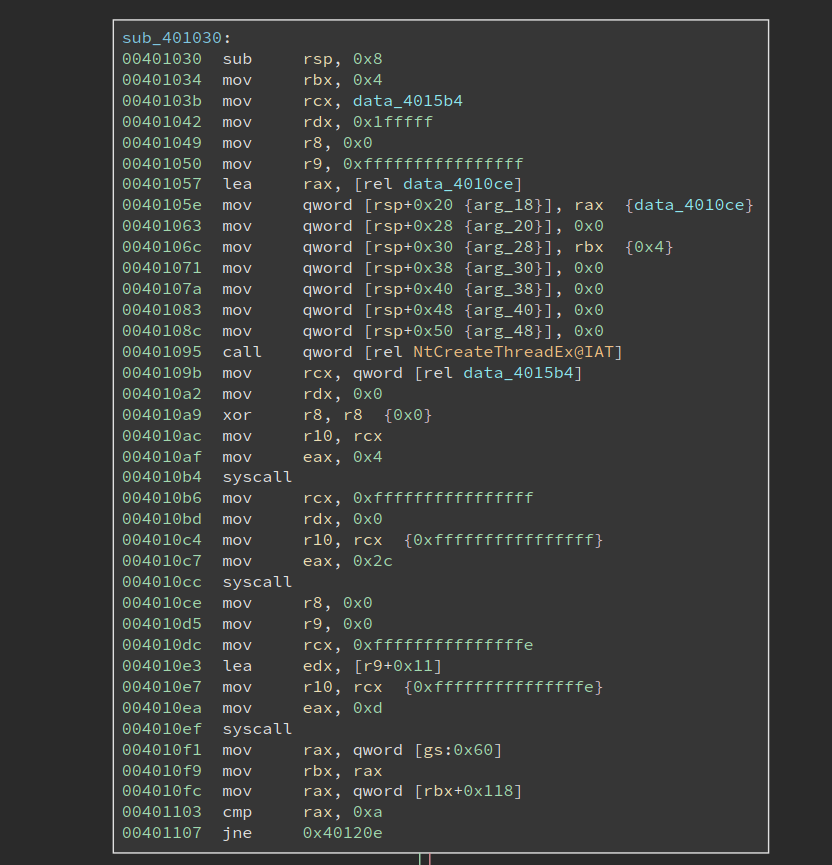
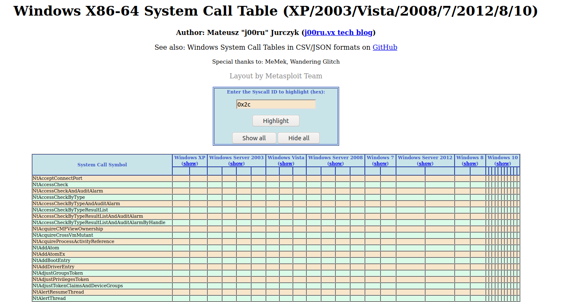
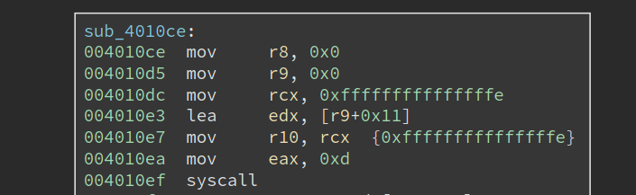
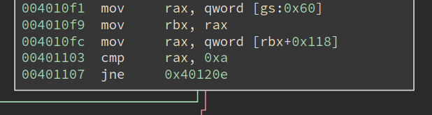
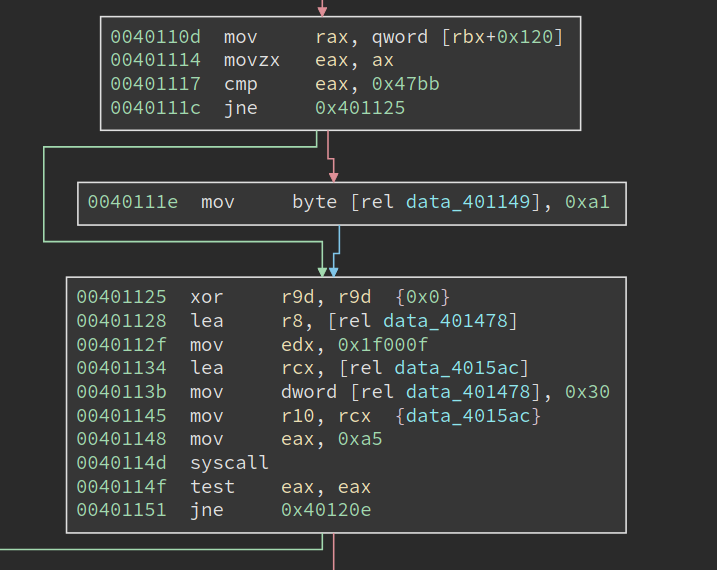

# Deciphering a Windows Anti-debugging Challenge

It has been a long while since I last wrote about anything. We try to post something every week, but it has been, at least for me, super busy recently. So sorry for the gap. The good news is I am going to post several writeups recently. 

This time I am writing about the challenge `ReverseMe3` from `jochen_`. The challenge can be found on [crackmes.one](https://crackmes.one/crackme/5fb1642933c5d424269a1850). The password to unzip is "crackmes.one".

The description given on the challenge page says the program will show a message box when it not running under a debugger. And the goal is to make it also show the message box when it is running under a debugger. Basically, to circumvent the anti-debugging techiniques.

Interestingly, the author mentions the program only runs properly on `3 latest builds of Windows 10. 1909 2004 and 20H2`. And if we were to conquer it inside a VM, we have to bypass one more check. So maybe the program uses some new feature that is introduced in the latest versions? Or it might be relying on low-level/un-documented features that only work on these versions. I do not have a VM that has the proper Windows build version, so I decide to solve it statically. 

As always, I will not only explain how to solve it correctly -- I will try to mention many of my thought processes as well as some detours that I have took. I believe this is more interesting to read than a flawless stright-sail. 

## First Impression

The challenge binary `ReverseMe3.EXE` is only 2.6 KB, relatively small. Loading it into BinaryNinja quickly reveals something that is unusal:



It first sets `eax` to 0x40, `bswap` it, and then calls `cpuid`. the `bswap` will make eax `0x40000000`, and acoording to my memory that does not return anything useful for `cpuid`. However, at `0x40101d`, the return value in `ecx` is moved into `eax`, which is then used to decrypt the code starting from `0x401030`. The code to be decrypted is 0x258 bytes long. Code at `00401030` immediately follows the decryption loop, and of course it cannot be properly disassembled since it is still encrypted.

From what I see now the challenge is probably hand-written. I like hand-written challenges since it can be denser in terms of tricks and traps, which is the fun of reverse engineering. 

Note the decryption only uses one byte from the return value of `cpuid`, so it is possible to try all 256 possibilities, disassemble the decrypted code and see which one can be disassembled properly. The same techiniques is used in one of the crackmes in the book "Reversing: Secrets of Reverse Engineering". 

## CPUID

But we do not have to do the hard work, at least for now. We can see what `cpuid` is returning and decrypt the code with the correct return value. However, as stated in the challenge description, this challenge does not run properly in a VM. And we know that `cpuid` sometimes return different values inside/outside the VM. So if we actually run the program, we probably get a wrong return value. 

Anyways, let us have a look at of the documentation about `cpuid`. In fact, `eax` register determines the type of information that will be returned by the `cpuid`. For example, if `eax` is zero upon the execution, `cpuid` will return the maximum valid input value for basic CPUID information. Besides, a value that is larger than 0x80000000 will reqeust extended CPUID information. However, these do not help us since the input is 0x40000000. 

In the doc, anything between 0x40000000 - 0x4FFFFFFF is descibed as:

```
Invalid. No existing or future CPU will return processor identification or feature information if the initial EAX value is in the range 40000000H to 4FFFFFFFH.
```

I was tempting to think the return value will be undefined, or even certain kind of fault will be triggered. However, we see clearly from the code that not only the `cpuid` should execute properly, its return value should be stable. 

Upon closer inspection of the documentation, I find that:

```
If a value entered for CPUID.EAX is higher than the maximum input value for basic or extended function for that processor then the data for the highest basic information leaf is returned.
```

I am not sure 0x40000000 is really greater than 0x80000000 -- maybe they do signed comparison. Anyways, we know what is going to happen: `the data for the highest basic information leaf is returned.`

Now that we still need to find the concrete return value. I do have a Windows VM, but that gives me 0x56 in `cl`, which after the decryption, gives me garbage rather than valid code. I am not planning to install an actual Windows machine to solve this challenge, so what should I do now?

I soon realize for things like `cpuid`, it does not really matter what OS I run. I am currently on Linux, but the value returned should be the same. I launched [`rappel`](https://github.com/yrp604/rappel), an assembly REPL tool.

```
> mov eax, 0x40000000
> cpuid
rax=00000000000008fc rbx=00000000000012c0 rcx=0000000000000064
rdx=0000000000000000 rsi=0000000000000000 rdi=0000000000000000
rip=0000000000400003 rsp=0000000000000033 rbp=0000000000000000
 r8=0000000000000000  r9=0000000000000000 r10=0000000000000000
r11=0000000000000000 r12=0000000000000000 r13=0000000000000000
r14=0000000000000000 r15=0000000000000000
[cf=0, zf=0, of=0, sf=0, pf=0, af=0, df=0]
cs=002b  ss=0000  ds=0000  es=0000  fs=0000  gs=0000            efl=00000202
```

The return value of `ecx` is 0x64. Is this reliable? Will it always return the same value on different machines? I tried to find the maximum index of the basic information by calling `cpuid` when eax is set to 0:

```
> mov eax, 0
> cpuid
rax=0000000000000016 rbx=00000000756e6547 rcx=000000006c65746e
rdx=0000000049656e69 rsi=0000000000000000 rdi=0000000000000000
rip=0000000000400003 rsp=0000000000000033 rbp=0000000000000000
 r8=0000000000000000  r9=0000000000000000 r10=0000000000000000
r11=0000000000000000 r12=0000000000000000 r13=0000000000000000
r14=0000000000000000 r15=0000000000000000
[cf=0, zf=0, of=0, sf=0, pf=0, af=0, df=0]
cs=002b  ss=0000  ds=0000  es=0000  fs=0000  gs=0000            efl=00000202
```

We can see the return value of eax 9s 0x16, which means the maximum basic information is 0x16. Then I set `eax` to 0x16 and call `cpuid` again:

```
> mov eax, 0x16
> cpuid
rax=00000000000008fc rbx=00000000000012c0 rcx=0000000000000064
rdx=0000000000000000 rsi=0000000000000000 rdi=0000000000000000
rip=0000000000400003 rsp=0000000000000033 rbp=0000000000000000
 r8=0000000000000000  r9=0000000000000000 r10=0000000000000000
r11=0000000000000000 r12=0000000000000000 r13=0000000000000000
r14=0000000000000000 r15=0000000000000000
[cf=0, zf=0, of=0, sf=0, pf=0, af=0, df=0]
cs=002b  ss=0000  ds=0000  es=0000  fs=0000  gs=0000            efl=00000202
```

Not bad, the exact same output is returned. So I am pretty confident calling `cpuid` with eax set to 0x40000000 has the same effect as calling it with 0x16. Looking for the value 0x16 in the table in Intel docs tells me that it returns `Processor Frequency Information Leaf`. For register `ecx`, it says "Bits 15 - 00: Bus (Reference) Frequency (in MHz)." 

I am not sure whether this information is all the same on different machines, since such bus frequency could vary in different cases. Please feel free to get in touch with me if you have any idea aboutg this! Anyways, if I do install a Windows machine and execute the program, I should get the same output. I proceeded with the value and used it to decyrpt the 0x258 bytes of encrypted code, starting at 0x401030. And the output defintely looks valid:



Before we proceed to analyze the decrypted code, I would like to see what is returned on a VM. I used a similar assembly REPL tool, [WinREPL](https://github.com/zerosum0x0/WinREPL), to checkout the result on Windows:

```
>>> mov eax, 0x40000000
>>> cpuid
assembled (2 bytes): 0f a2
rax: 0000000040000006 rbx: 00000000786f4256 rcx: 00000000786f4256 rdx: 00000000786f4256
r8 : 0000000000000000 r9 : 0000000000000000 r10: 0000000000000000 r11: 0000000000000000
r12: 0000000000000000 r13: 0000000000000000 r14: 0000000000000000 r15: 0000000000000000
rsi: 0000000000000000 rdi: 0000000000000000
rip: 0000023ca56f000e rsp: 000000478b2fef00 rbp: 0000000000000000
flags: 00000200  CF: 0  PF: 0  AF: 0  ZF: 0  SF: 0  DF: 0  OF: 0
```

When we run `cpuid` with `eax` set to 0x40000000, the return value in ecx is actually the string "VBox". I am not entirely sure which basic information it is trying to return, so I set `eax` to 0 to find out:

```
>>> mov eax, 0
>>> cpuid
assembled (2 bytes): 0f a2
rax: 0000000000000016 rbx: 00000000756e6547 rcx: 000000006c65746e rdx: 0000000049656e69
r8 : 0000000000000000 r9 : 0000000000000000 r10: 0000000000000000 r11: 0000000000000000
r12: 0000000000000000 r13: 0000000000000000 r14: 0000000000000000 r15: 0000000000000000
rsi: 0000000000000000 rdi: 0000000000000000
rip: 0000023ca56f0007 rsp: 000000478b2fef00 rbp: 0000000000000000
flags: 00000200  CF: 0  PF: 0  AF: 0  ZF: 0  SF: 0  DF: 0  OF: 0
```

Not bad, it returns the same value when running on a real machine, 0x16. However, when I run `cpuid` with `eax` set to 0x16, I get the surprising output:

```
>>> mov eax, 0x16
>>> cpuid
assembled (2 bytes): 0f a2
rax: 0000000000000000 rbx: 0000000000000000 rcx: 0000000000000000 rdx: 0000000000000000
r8 : 0000000000000000 r9 : 0000000000000000 r10: 0000000000000000 r11: 0000000000000000
r12: 0000000000000000 r13: 0000000000000000 r14: 0000000000000000 r15: 0000000000000000
rsi: 0000000000000000 rdi: 0000000000000000
rip: 0000023ca56f0015 rsp: 000000478b2fef00 rbp: 0000000000000000
flags: 00000200  CF: 0  PF: 0  AF: 0  ZF: 0  SF: 0  DF: 0  OF: 0
```

Then return values are all zero, and they are different from those returned when we set `eax` to 0x40000000. To sum up, the output is wrong in two senses: 1). when we set `eax` to 0x16, it does not return a valid CPUID information; 2). when we set `eax` to 0x40000000, it does not give the same output as if we were running `cpuid` with `eax` set to the maximum index of basic information, in this case 0x16. So these two are subtle differences between a real machine and a VM, which can be used as VM detection as well.

## Native Syscall on Windows

Now it is time to analyze the decrypted code. Looking at the image above, we notice it first calls `NTCreateThread` to create a thread, whose entry is at 0x4010ce. And it then makes two system calls using the `syscall` instruction. Note the thread entry 0x4010ce is right below the code that makes syscalls, and the two syscalls do not seem to transfer the control to any other places, so it is very likely they are not doing something special. 

But we still need to figure out what the two syscalls are doing. I did not see any challenges using `syscall` on Windows, mostly because the system call index is opaque on Windows, and they can be different across different system versions. Oh, this could be the reasono why the author says it only works on specific versions of the Windows -- it relies on the specific index of certain system calls.

There are many ways to dump the system call on a Windows system. However, since my Windows VM is having a wrong build version, the system call index I can get is also probably NOT the same as the author expects. So I searched online for a bit and found something already organized the information into a nice searchable table at: https://j00ru.vexillium.org/syscalls/nt/64/.



So the first syscall is made with eax = 4, and I found it is `NtWaitForSingleObject`. And the object it waits for happen to be the newly creatd thread. The next system call is 0x2c, which is `NtTerminateProcess`. So the remaining code just waits for the therad to finish, and terminate the process.

We also see that the index for these two system calls are differnt on different major Windows versions, e.g., Win7 v.s. Win10, but they remain the same within different Win10 versions. So they do not account for the special requiement for the three Win10 builds.

So now we shift the focus of the analysis to the thead routine, as shown below:



It starts by making a syscall 0xd, which translates to `NtSetInformationThread`, with `r9` set to 0x11, which means `ThreadHideFromDebugger`. This is a common anti-debug techinique that tried to hide the thread from the debugger. The thread will continue to execute, but the debugger will no longer be notified by any debug events related to the thead.



Next, it retrieves `PEB` at `gs:0x60`, at checks whether the field at 0x118 is equal to 0xa. Inspecting the structure with windbg shows (some output omitted):

```
lkd> dt _PEB
nt!_PEB
...
   +0x118 OSMajorVersion   : Uint4B
   +0x11c OSMinorVersion   : Uint4B
...
```

So it is checking whether the OSMajorVersion is 10. Yeah, so it is checking whether this is a Win10.



Moving downward, we see that it is checking OSMinorVersion for a specific value, 0x47bb. I have no idea what it is (though there is definitely ways to figure it out). If the version matches, we see it is setting the dword at 0x401149 to be 0xa1. At first I do not really understand it, so I skipped it and moved to analyze the code at 0x401125. 

The next system call it makes is 0xa5. 