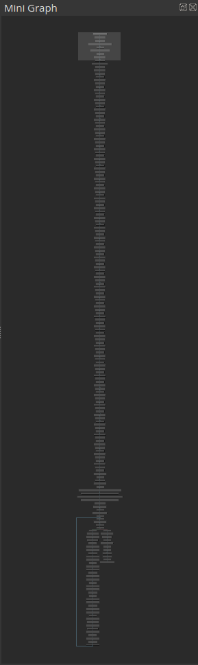
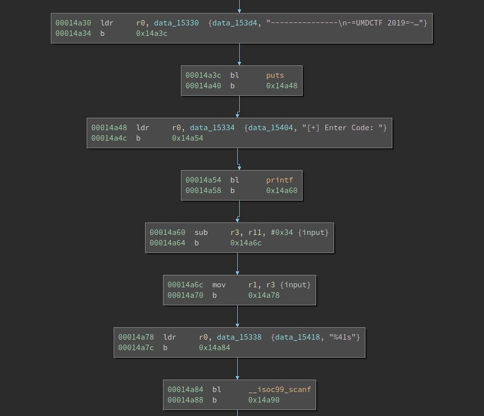
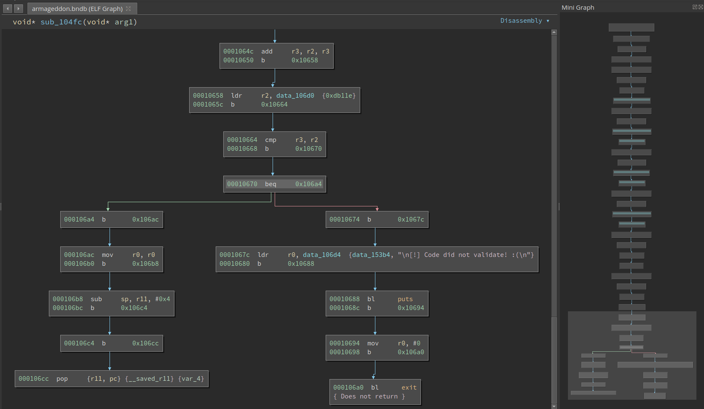

# Solving an ARM challenge with z3

## First Impression

The last week's challenge is hosted at https://crackmes.one/crackme/5edb0b8533c5d449d91ae73b. It is authored by Towel and it is a real challenge in UMDCTF 2019. 

Loading it into BinaryNinja reveals that it is an ARM binary. Not very surprised as its name is `armageddon`. ARM is no longer special for me as I gradually become familiar with the ISA. After all, it is simpler than the x86 and those frequently used instructions are easy to understand and remember. 

BinaryNinja has no problem recognizing the `__libc_start_main` and I can get to `main` easily. The first thing I find is that `main` is a **long** function. 



Well, a long function is not necessarily hard to analyze. It probably leverages certain obfuscation and/or its code is pretty repetitive. I started browsing the code from the beginning. 



It first prints a welcoming message and then asks the user to type the input. After that, it calls `scanf` with `"%41s"` which reads at most 41 chars from the terminal. Not bad, we now know it accepts a string as the input and we know the maximum length of it. 

We also notice that the basic blocks are split into quite short ones. This is probably an obfuscation technique. Nevetheless BinaryNinja kind of automatically accounts for it so we are not bothered by it. If a disassembler does not correctly inline the blocks after the jump (`b`), it could be harder to analyze. 

After reading the input, the code becomes repetitive: each time, a function is called with the user input as its only parameter. The pattern is repeated until near the bottom of the function, where a loop is found. The loop could be decrypting the flag based on the correct user input. And the checks on the input is obviously inside these called functions. 

I followed the first check function and it looks like this: 



Near the bottom of the function we see the comparison and if the comparison is not equal, an error message is printed. After analyzing the algorithm, I find the constraint is:

```
passwd[1] * passwd[0x27] * passwd[0x15] + passwd[0x11] + passwd[0x13] * passwd[0x1e] == 0xdb11e
```

I browsed several other check functions and they all look similar. Now it becomes obvious: There are a series of constraints and the correct input must satisfy all of them. 


## Round One: Failure of angr

This challenge is very suitable for tools like `angr` or `z3`. In fact angr also uses z3 as its constraint solving backend. However, angr can automatically extract constraints from the binary, which could save a lot of time for reversers. So I decided to first give angr a try. 

The code is not hard to write -- especially they all look similar for different binaries. 

Code for [angr-solve.py](angr-solve.py)

```Python
import angr
import claripy

proj = angr.Project('./armageddon')
print(hex(proj.entry))
start_address = 0x14a88
state = proj.factory.entry_state(addr = start_address)

input_addr = 0xaa000000
r11 = input_addr + 0x34
state.regs.r11 = r11

n = 42
flag = state.solver.BVS('flag', n * 8)
state.memory.store(input_addr, flag)

simgr = proj.factory.simgr(state)
good = 0x1504c
simgr.explore(find = good,
        avoid = [
            0x10674,
            0x107c8,
            0x109ac,
            0x10b6c,
            0x10cf0,
            0x10ea4,
            0x11010,
            0x11190,
            0x11308,
            0x114a4,
            0x116a8,
            0x1185c,
            0x119c8,
            0x11b84,
            0x11d38,
            0x11f10,
            0x120c4,
            0x122e4,
            0x124c8,
            0x1264c,
            0x12800,
            0x12948,
            0x12b1c,
            0x12d30,
            0x12e9c,
            0x13070,
            0x13248,
            0x133e0,
            0x135f0,
            0x137d4,
            0x13970,
            0x13b50,
            0x13cbc,
            0x13e6c,
            0x14014,
            0x141c8,
            0x1434c,
            0x144c4,
            0x14648,
            0x1485c,
            0x149a0
        ]
        ) 

if simgr.found:
    solution_state = simgr.found[0]
    input1 = solution_state.solver.eval(flag, cast_to = bytes)
    print('flag: ', input1)
else:
    print('Cound not find flag')

```

We tell angr where is the input, and specify a good address to reach, as well as an (optional) list of addresses to avoid. Those addresses to be avoided are those printing error messages. 

This, in theory, should work. However, after running for several minutes angr tells me there is no solution. This is a little bit surprising as I assume as long as there is a solution, angr either returns it or keeps running. There could be multiple reasons for it, e.g., a bug in angr, or the constraints are not properly lifted, etc. We could output the constraints that angr is solving and troubleshot what went wrong. But please allow me to save it as future work. 

## Round Two: Conquering it with z3

The next option is to convert the constraints into Python syntax and solve it with z3. The transcribing is arduous work and prone to error. It is better done in an automated or semi-automated way. 

I opened the challenge binary in Ghidra and found that the decompilation is generally good:

```C
int FUN_000104fc(int param_1)

{
  if ((uint)*(byte *)(param_1 + 1) *
      (uint)*(byte *)(param_1 + 0x27) * (uint)*(byte *)(param_1 + 0x15) +
      (uint)*(byte *)(param_1 + 0x11) +
      (uint)*(byte *)(param_1 + 0x13) * (uint)*(byte *)(param_1 + 0x1e) != 0xdb11e) {
    puts("\n[!] Code did not validate! :(\n");
                    /* WARNING: Subroutine does not return */
    exit(0);
  }
  return param_1;
}
```
Then I copy-and-pasted all the constraints into a temp script and converted it into Python syntax. Note this work is still quite repetitive, so I decided to convert the code with a regular expression. 

I did it in VS Code. I searched for 

```Python
\(uint\)\*\(byte \*\)\(param_1 \+ ((0x)?[0-9a-f]+)\)
```

and replaced them with 

```
passwd[$1]
```

Basically, this will convert `(uint)*(byte *)(param_1 + 1)` to `passwd[1]`. There are still manual works needed, like removing the `if`, etc. But those are not hard to do. 

Eventually, the solving script looks like this [(z3_solve.py)](z3_solve.py.py):

```Python
from z3 import *

n = 41
passwd = [BitVec('s_%d' % i, 32)  for i in range(n)]

s = Solver()
for i in range(n):
    s.add(passwd[i] >= 0x21)
    s.add(passwd[i] <= 127)

s.add(passwd[1] * passwd[0x27] * passwd[0x15] + passwd[0x11] + passwd[0x13] * passwd[0x1e] == 0xdb11e)
s.add(passwd[0x25] - passwd[0x13] * passwd[0xc] == -0xc0c)
s.add(((passwd[2] - passwd[0x1f]) + passwd[0x21] * passwd[0xd] * passwd[0x14]) - passwd[0x11] == 0xebd1d)
s.add((passwd[7] + passwd[0x24] * passwd[0xf]) - passwd[0x1d] * passwd[0x22] == 0x18e5)
s.add((passwd[0x15] - passwd[0x1b] * passwd[0xf]) - passwd[0x11] == -0x2e3b)
s.add(((passwd[0xf] - passwd[0x25] * passwd[8]) - passwd[5]) - passwd[6] == -0x19a5)
s.add(((passwd[0x23] + passwd[0x1d]) - passwd[0x14]) + passwd[0x1a] == 0xc4)
s.add(passwd[7] * passwd[0x20] + passwd[0x1f] * passwd[0xb] == 0x45ca)
s.add(passwd[0x1d] * passwd[0x18] * passwd[0x24] + passwd[0x25] == 0xac3fb)
s.add(((passwd[8] - passwd[0x10]) - passwd[0xc]) + passwd[0x28] + passwd[0xf] == 0xd0)
s.add((passwd[0x23] * passwd[0x11] * passwd[0x0] - passwd[0xb]) + passwd[0xc] * passwd[7] * passwd[0x26] == 0x172e48)
s.add(((passwd[0x1a] - passwd[0xd]) + passwd[3] * passwd[8]) - passwd[5] == 0x10b8)
s.add(passwd[3] + passwd[0x11] + passwd[0x24] + passwd[0x14] == 0x160)
s.add((passwd[0x1a] - passwd[0x15] * passwd[0x12]) + passwd[0x1b] * passwd[0x19] == 0x8a2)
s.add((passwd[0x22] - passwd[0xe]) + passwd[5] * passwd[0x21] + passwd[0x23] == 0x1bd8)
s.add(passwd[5] * passwd[8] * passwd[0x26] * passwd[0x19] + passwd[0x15] + passwd[0x23] == 0x2ca6988)
s.add((passwd[8] * passwd[8] + passwd[0x15] * passwd[0xc]) - passwd[0x24] == 0x2430)
s.add((((passwd[0x23] + passwd[2]) - passwd[7]) - passwd[9] * passwd[0x12]) + passwd[2] * passwd[0x27] == 0x2de)
s.add(((passwd[5] * (passwd[0x11] - 1) - passwd[6]) - passwd[0x14]) - passwd[0x22] * passwd[0x17] == -0x11d5)
s.add((passwd[0x22] - passwd[0xb]) + passwd[0xb] * passwd[0xd] == 0x2aba)
s.add((passwd[0x22] - passwd[0xb]) + passwd[0xb] * passwd[0xd] == 0x2aba)
s.add(passwd[0x1b] + passwd[0x12] * passwd[0xf] + passwd[0x20] + passwd[9] == 0x2668)
s.add(passwd[0x15] - passwd[0xe] * passwd[0x1d] == -0x1400)
s.add((((passwd[9] * passwd[9] - passwd[10]) + passwd[0xd]) - passwd[0x24]) - passwd[0x14] == 0x19ac)
s.add(((passwd[0xc] + passwd[2] + passwd[0x22]) - passwd[4] * passwd[0x14] * passwd[0x17]) + passwd[0x16] == -0xafa0c)
s.add(((passwd[4] + passwd[5]) - passwd[10]) + passwd[0x1b] == 0xb4)
s.add(((passwd[0xf] - passwd[0x1c]) - passwd[0x25]) - passwd[0x18] * passwd[0x12] * passwd[0x0] == -0xd06e8)
s.add(((passwd[4] * passwd[0x23] + passwd[0x19]) - passwd[0x15]) - passwd[0x18] * passwd[0x14] == -0x1f8)
s.add((((passwd[0x19] + passwd[10]) - passwd[0xf]) + passwd[0x1c]) - passwd[0x21] == 0x3e)
s.add((((passwd[6] - passwd[0x19]) + passwd[2]) - passwd[0x19]) + passwd[1] + passwd[0x12] * passwd[0x1c] == 0x1eb9)
s.add(passwd[0xb] * (passwd[5] + passwd[0x22] * passwd[0x16]) + passwd[0xc] + passwd[0x22] == 0x121b93)
s.add((((passwd[3] + passwd[0xe]) - passwd[0x26]) - passwd[0xd]) - passwd[1] == -0x80)
s.add((((passwd[0x1e] + passwd[0x15]) - passwd[0x11]) - passwd[0x17] * passwd[5]) + passwd[0x21] == -0x1afd)
s.add((passwd[7] - passwd[0xe]) + passwd[0x11] + passwd[0x21] == 0xdf)
s.add((passwd[8] - passwd[3]) + passwd[2] * passwd[10] * passwd[10] == 0x626e2)
s.add(((passwd[0x25] + passwd[7]) - passwd[0x13]) + passwd[0xc] + passwd[0xb] == 0x12f)
s.add(passwd[1] + passwd[8] * passwd[0x14] + passwd[0x20] + passwd[0xf] == 0x167a)
s.add((passwd[0x11] - passwd[4]) - passwd[0x1d] * passwd[0x12] == -0x11ca)
s.add((passwd[0xd] * passwd[0x16] - passwd[10]) - passwd[0x23] == 0x32e9)
s.add(passwd[0xd] + passwd[0xb] + passwd[0x1d] * passwd[0x13] == 0xec9)
s.add((((passwd[0x19] + passwd[0x26] * passwd[0xf]) - passwd[0xb]) + passwd[0x20]) - passwd[0x15] * passwd[0x22] == 0x2a)
s.add(passwd[6] * passwd[9] + passwd[0x23] == 0xedd)

if s.check() == sat:
    print('solved!')
    m = s.model()
    flag = ''
    for i in range(n):
        c = m[passwd[i]].as_long()
        flag += chr(c)
    print(flag)
else:
    print('failed')
```

One thing to mention here is although the individual chars of passwd are only 8 bits wide, we declare them to be 32-bit wide. Otherwise, it could cause a problem to the `==` at the end of the line. Obviously, we have to add the constraint `passwd[i] >= 0x21` and `passwd[i] <= 127`, to actually enforce they are printable ASCII chars. 

Running this immediately returns the flag:

```
UMDCTF-{ARM_1s_s0_SATisfying_7y8fdlsjebn}
```

## Epilog

Despite z3 returns a result and it looks quite convincing, there are still some code below the last constraint. Typically, in CTF, this means the correct input that passes the constraints is NOT the actual flag; rather the input is used to decrypt the flag to be submitted. However, the above code is already in a good flag format. This confuses me so I decide to run the binary to see what happens. There is an excellent tool for this situation: the process level emulator -- [`Qiling`](https://www.qiling.io/). 

Qiling is an emulator based on Unicorn. It is simpler than Qemu since it only emulates the process that we are interested in. So there is no need to set up a bulky OS to run it. The code is extremely simple [(qiling_emulate.py)](qiling_emulate.py):

```Python
from qiling import *

if __name__ == "__main__":
    ql = Qiling(["./armageddon"], "QILING_INSTALL_PATH/examples/rootfs/arm_linux")
    ql.run()
```

Since major system calls are implemented by Qiling, the program executes properly. Below is an excerpt of the output: 

```
write(1,27008,16) = 0
[+] write() CONTENT: bytearray(b'[+] Enter Code: ')
[+] Enter Code: UMDCTF-{ARM_1s_s0_SATisfying_7y8fdlsjebn}
read(0, 0x29010, 0x2000) = 42
write(1,27008,1) = 0
[+] write() CONTENT: bytearray(b'\n')

write(1,27008,33) = 0
[+] write() CONTENT: bytearray(b'[+] Code validated successfully!\n')
[+] Code validated successfully!
write(1,27008,1) = 0
[+] write() CONTENT: bytearray(b'\n')

[!] 0xf7ca9be8: syscall number = 0x8c(140) not implemented
exit_group(0)
```

So after we supply the correct code, it simply prints `Code validated successfully!\n`. 

LoL! I forget that it does not tell us the code is correct yet. Well, not bad, since playing with Qiling is quite painless. 