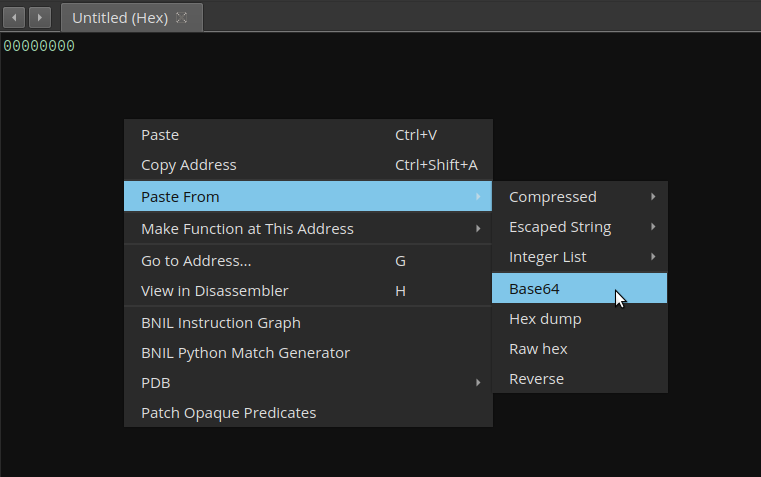
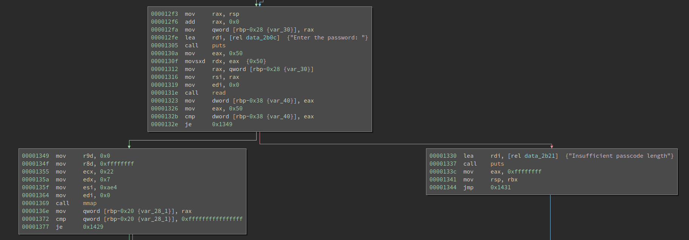
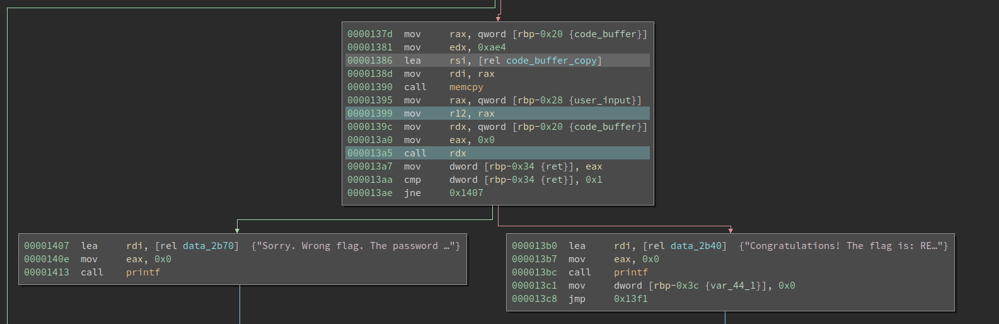
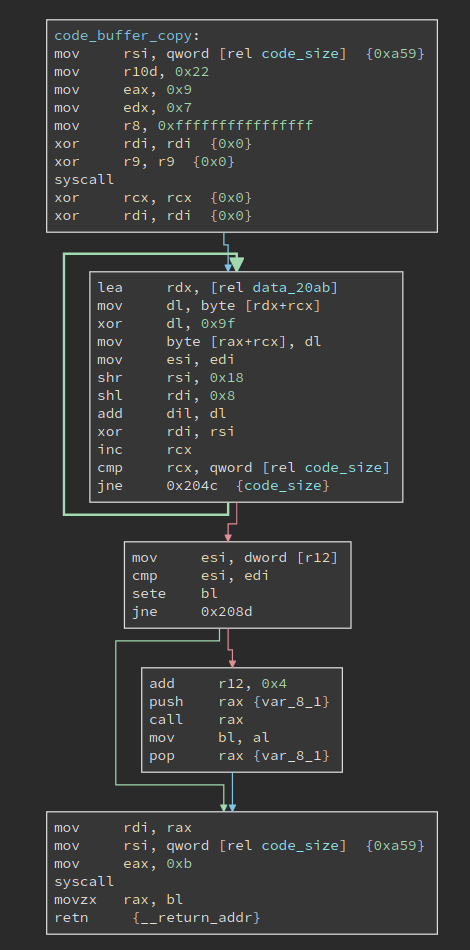
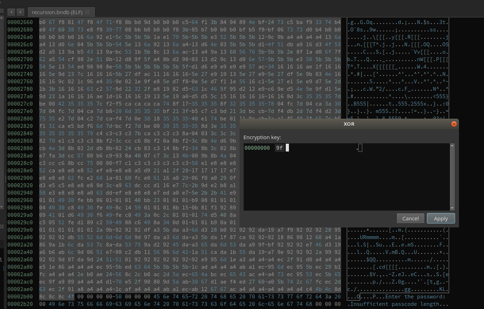
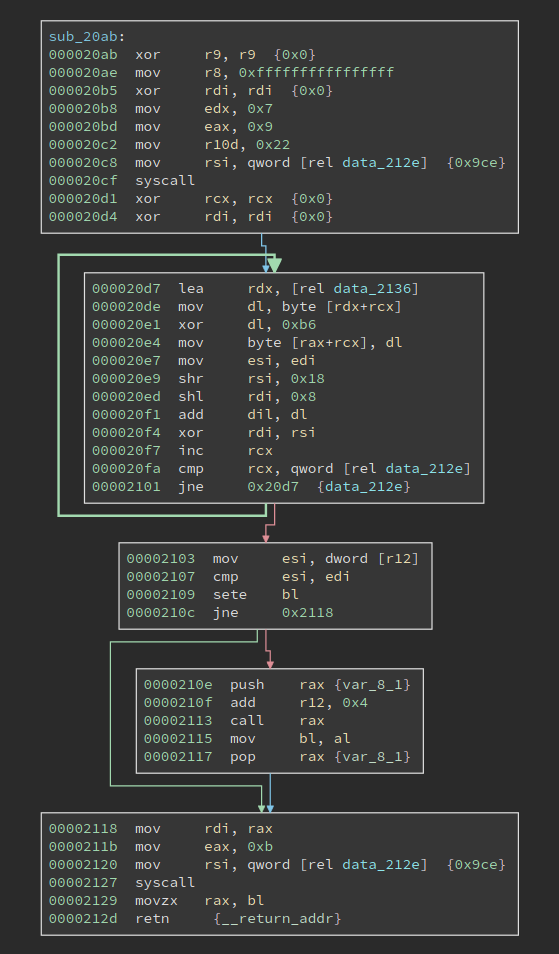

# Solving a Recursive Crackme by Automating GDB

The last week's challenge is called [`Recursion`](https://0x00sec.org/t/reverseme-recursion/21802). From the name we already expect to do some automation -- manually solving stuff recursively is not a wise idea. 

## First Impression

The forum probably does not allow users to post binary files, so challenges are all posted as base64 encoded. There are too many ways to restore the binary, but Binary Ninja saves you from remembering the command: Just copy the encoded text, create a new empty binary, and then click "Paste From" -> "Base64". Then you are done! 



We get a 14.5 kB ELF file. There is some mild obfuscation in the start of the `main`, which does not pose a serious challenge. In the middle of the `main` we see the program is reading input and checking length:



The first thing I notice is that the input must be exactly 0x50 chars, which is quite unusual. Not it reads at most 0x50 chars and checks if the chars read are at least 0x50 chars, which means it must be 0x50 chars. 

Besides, after the length check, we see it calls `mmap`. For reversing challenges, once we see a `mmap` in it, probably there is a self-modifying code. 



Moving downward we see that the program copies a 0xae4-byte buffer into the newly allocated buffer, and then calls it. A strange thing here is the user input is moved into register `r12`. Typically, no compilers will use register `r12` to pass function argument, so this code might be hand-crafted.

After the `call rdx`, the program tells if the flag is correct based on the return value. Now the next step is obvious, we need to define a function on that code buffer and see what it has.

## Decryption routine



The function looks like this. The loop decrypts another buffer at `data_20ab`, whose size is 0xa59. The decryption is just xor with 0x9f. Note the code_size variable sits right after this function, and right before the next data buffer to be decrypted. Meanwhile, the loop calculates a checksum of the next data buffer, and compare it with the dword at register `r12`. What is it? It is the user input! So the user input must match the checksum value. 

If the checksum matches, the program continues to execute the second newly decrypted buffer. Here, we can use Binary Ninja's transformation to transform the data in place, after which we define a function at the start of it. 



The newly defined function looks like this:



It looks almost the same as the previous one, except for some small mutations. The xor key is different and it is 0xb6 this time. The buffer size is 0x9ce this time, which is smaller than the previous one. And that indicates we are probably recursively decrypting this buffer and each time we only decrypt the first part of it, which forms a function.

I tried to repeat the process a few times and it just repeats. RECURSION. That is probably a good reason for the name.

The first way to solve this is to solve it statically. We only need to get the xor key and the buffer size, to decrypt the buffer and calculate the checksum. However, due to the mutation, it is not that easy to get it correct. It is, though, definitely possible, but not optimal. So I come up with a dynamic approach. 

## Using Hardware Breakpoints and Automating GDB 

I did not rewrite the checksum algorithm by myself, despite it is super simple. Even if it is super complex and I cannot reverse/rewrite it, I can still solve this challenge. Why?

Because we can wait at the line where the dword from the user input is compared with the correct checksum. Particularly, it is the `cmp esi, edi` line. the register `esi` holds our input, which, during debugging, is trash. Register `edi` holds the correct checksum. If we set a breakpoint here and examine the value of `edi`, we directly get the correct checksum.

However, this approach cannot easily scale to the entire challenge. The problem here is we do not know where to set the next breakpoint before we decrypt the code. However, manually decrypting the code is arduous and error-prone, so we would better automate the solution.

Note the address of the user input buffer is moved into r12 and never changed. If one checksum matches, the program executes `add r12, 0x4` to move to the next dword. So we can use a hardware breakpoint to catch the program when it reads the buffer `r12`, and read the value of `edi`. Then we remove the current hardware breakpoint, set a new one on the next address, and wait for the program to break again.

Automating GDB is easier said than done. I have known it is possible for a long time, though I have never done it before. After duckduckgo-ing a little bit, I found there are two ways to do it. The first one is to implement a GDB command in Python; the second way is to use pygdbmi to interact with GDB's machine interface.

Both methods allow us to execute gdb commands as if we directly use GDB, and get the output from GDB afterward. However, I found the pygdbmi approach is much harder to use for the current purpose. First of all, it runs GDB headlessly. So if there is an error in the script, it is hard to find it. Conversely, if we take the first approach, since we register ourselves as a new command (`solve` in particular) after we run the stuff we are still in GDB. We can see the commands we executed and see the outputs from GDB, which allows painless debugging. Also, despite the name machine interface, it does not automatically parse the string output from GDB. For example, if we examine the value of `rdi` by executing

```p/x $rdi```

The GDB returns something like:

```$1 = 0x555555557e90```

I would expect the pygdbmi to parse the value for me. However, it does nothing for this and directly returns the string output. We get the very same thing in the first approach. So obviously it is the better way to do it. 

Note that I am not saying gdbmi is not good. It is used by various projects, e.g., gdbgui, which is a browser-based GDB frontend. If you have not tried it, I strongly recommend you to experiment with it. It is just using gdbmi will require more development work and it is not suitable for reversing challenge, where we care more about getting things rolling faster. 

Ok, so much for the comparison. It is time to get to the code. The code is not fancy -- it just requires some effort to write it correctly. 

```Python
import gdb
import struct

def get_reg_value(response):
    response = response.split()[2]
    value = int(response, 16)
    return value
    
class Solve(gdb.Command):
    def __init__(self):
        # This registers our class as "solve"
        super(Solve, self).__init__("solve", gdb.COMMAND_DATA)

    def invoke(self, arg, from_tty):
        # When we call "solve" from gdb, this is the method
        # that will be called.

        dummy_input = open('input.txt', 'wb')
        dummy_input.write(b'1' * 0x50)
        dummy_input.close()

        solution = bytes()

        inferiors = gdb.inferiors()
        inferior = inferiors[0]
        gdb.execute('del')
        gdb.execute('file crackme.elf')
        gdb.execute('set breakpoint pending on')
        gdb.execute('b __libc_start_main')
        gdb.execute('r < input.txt')
        response = gdb.execute('p/x $rdi', to_string = True)
        main_addr = get_reg_value(response)
        main_addr_raw = 0x1229
        print(main_addr)
        base = main_addr - main_addr_raw

        gdb.execute('b *%d' % (base + 0x1399))
        gdb.execute('c')

        response = gdb.execute('p/x $rax', to_string = True)
        input_addr = get_reg_value(response)
        print('input_addr', hex(input_addr))
        
        i = 0
        while True:
            try:
                gdb.execute('del')
                gdb.execute('rwatch *%d' % (input_addr + i * 4))
                gdb.execute('c')

                response = gdb.execute('p/x $edi', to_string = True)
                checksum = get_reg_value(response)
                print('checksum', hex(checksum))
                solution += struct.pack('<I', checksum)
                
                gdb.execute('set $rsi = %d' % checksum)
                i += 1
            except:
                break

        print('=' * 50)
        print('the flag is:')
        print(solution)
        print('len:', len(solution))

        output = open('solution.txt', 'wb')
        output.write(solution)
        output.close()


# This registers our class to the gdb runtime at "source" time.
Solve()
```

To use it, 
1. run gdb
2. inside gdb, run `source gdb_solve.py`
3. inside gdb, run `solve`
4. after it runs, it should print the solution and also write it to solution.txt
5. verify it by `cat solution.txt | ./crackme.elf`

Which is quite simple, isn't it? Maybe the command `rwatch` is new, which sets hardware read/write breakpoints. 

The correct flag contains non-printable chars, which is not surprising, as it is unlikely the checksum of the code happens to be a printable string. Unless the maker put some effort to make it that way.

In the above script, there is one thing to point out. We run 

```set breakpoint pending on```

before 

```b __libc_start_main```.

This is because, if we do not do it, the attempt to set a breakpoint on `__libc_start_main` will produce an error. And it only happens before we run the binary. So in other words, if we first run the binary in GDB for at least once, and then directly set a breakpoint on `__libc_start_main`, it will succeed. That is because GDB has seen that function once, and it knows to wait for it. However, since we are automating GDB, every time it bootstraps cleanly and it does not know there exists a `__libc_start_main`, hence the error. I am not familiar enough with the GDB source code so I cannot speculate why it happens, but probably there are some reasons behind it. Anyway, `set breakpoint pending on` is the correct way to deal with it. 

The author also released his/her own [writeup](https://0x00sec.org/t/reverseme-recursion/21802/4?u=xusheng), which needs to be decrypted by the correct flag. I suggest you to have a look at it, espcially the mutation part. 