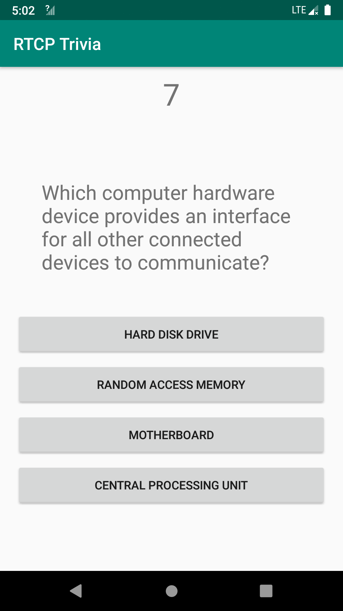
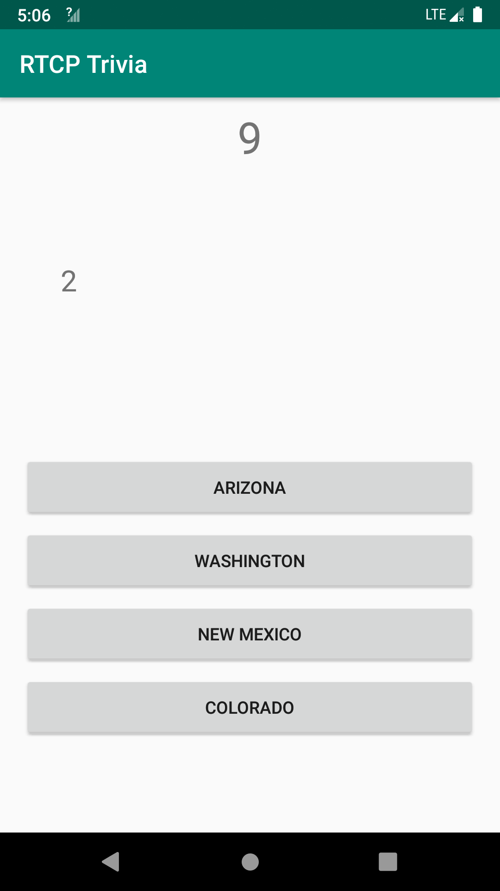
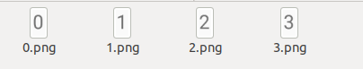
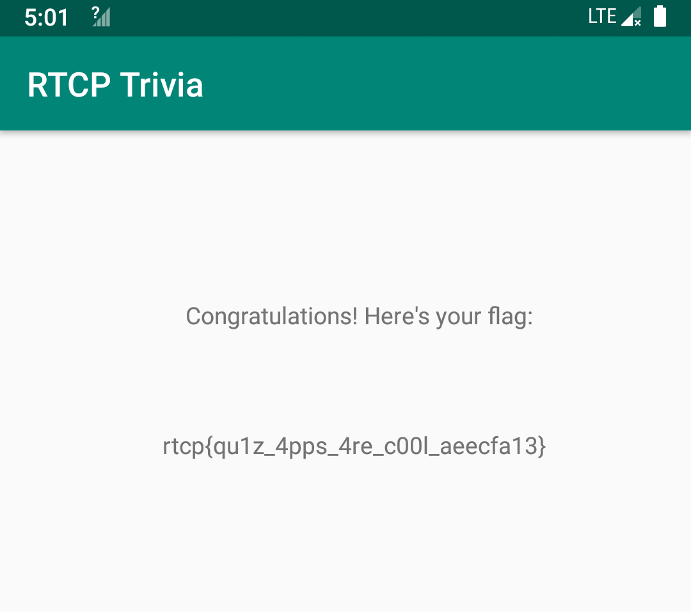

# Solving a Reversing Challenge with Mitmproxy and OCR

Over the weekend I had some fun with the [Houseplant CTF](https://houseplant.riceteacatpanda.wtf/home). Among the reversing challenges, the [**RTCP Trivia**](https://houseplant.riceteacatpanda.wtf/challenge?id=8) is particularly interesting and I would like to share my unconventional way of solving it. 

## First Impression

We get a **client.apk** after downloading the challenge. I have no Android phones so I ran it in an emulator. It has no ARM native library so it runs well in x86 emulators. 

After asking for a user name, the app presents a multiple-choice problem with four options (shown below). The problem itself is not difficult. However, there is a ten-second countdown and we must answer it before the time elapses. The challenge description says that we need to correctly answer 1000 such problems. So manual solving is probably not a wise idea. 



## Inspecting the Traffic

After I unzipped the apk and inspected the files inside of it, I found the challenges are not stored inside the apk. I confirmed this by cutting the network to the emulator -- it longer shows new challenges or tells you the answer is wrong. 

I inspected the resources of this app and found the real flag is not there (a fake flag can be found in the strings). So it probably comes from the server after we solve 1000 problems. 

I then launched Wireshark to have a look at the traffic. The app uses websocket to communicate with the server. The problem is sent from the server and the choice is submitted to the server. So the logic is not local. But I quickly notice something strange:

```JSON
{
    "method": "question",
    "id": "30a3956f-cd60-4c51-bc01-dbbf1b09f9b0",
    "questionText": "S62ZtWoNqto0jxuZalalAmv4s/n2GmaTai5Z7/bVsk6W48CbtUvYcOyVRi7qcPeP",
    "options": [
        "bNMO3oWCI/s5OHBEiXfgkg==",
        "qpDFxRVJXyczm52QbPTa8A==",
        "8UQQMs42vvLpLIq0wNEIaw==",
        "cLYF4H6LVlIi3YPF3R4MUg=="
    ],
    "correctAnswer": "mboZgfosD3S1ZUf330zmxaeq+bR2vzKkCV2AKOB8vlA=",
    "requestIdentifier": "f814ce11519a16be435ac73bc0e89238"
}
```

Despite most data are encrypted, we see that the **correctAnswer** is also sent to the client. This means if we can decrypt it, we get the correct answer. And we know the app can decrypt the questionText and options, since it needs to show them to us. It is highly likely that the answer is encrypted in the same way and we can also decrypt it. 

## Reversing the Algorithm? No! 

A routine way to solve this is: 1). reverse the app to find out the encryption algorithm; 2). rewrite a client to communicate with the server. I did not take this approach since: 1). although it is easy to find out the encryption algorithm is AES and the iv is indeed requestIdentifier, it is not immediately clear how is the key generated. 2). I mistakenbly think the traffic sent from the client to the server is encrypted using a custom crypto (which later turns out to be just compression). These two obstacles are not prohibiting me from solving it, but I think it will take longer than I expected, so I decide to try a novel method. 

After reading how the app displays the question text, I found that if I swap the keyword "questionText" with "requestIdentifier" in the json, the correct answer will be displayed on the screen! 

Since the traffic is plaintext websocket, it is quite easy to implement it. I first tried Burp but it does not support match-and-replace in websocket. Then I used [mitmproxy](https://mitmproxy.org/). Mitmproxy allows us to script in Python, so we can easily modify the traffic. 

I copy-and-pasted one example from the official repo and made some changes. The following code will change ```'correctAnswer'``` to ```'questionText'``` and change ```'questionText'``` to ```'replaced'```: 

```Python
from mitmproxy import ctx
def websocket_message(flow):

    message = flow.messages[-1]

    if message.from_client:
        ctx.log.info("Client sent a message: {}".format(message.content))
    else:
        ctx.log.info("Server sent a message: {}".format(message.content))

    if 'correctAnswer' in message.content:

        message.content = message.content.replace('questionText', 'replaced')
        message.content = message.content.replace('correctAnswer', 'questionText')
```

Mitmproxy scripts are not meant to run on its own. Instread, we should run tools from mitmrpoxy and specify it with the ```-s``` option:

```
mitmdump -s ./mitm-solve.py
```

And it works! Now instead of the question text, the app shows the index of the correct answer to us. 



I tried to solve it by hand. But even if I have the correct answer, I still cannot stop clicking the wrong button. I do not want to solve it as an action game, so I start to seek viable ways to automate the solving. 

The good thing is, mitmproxy allows us to inject packets. And thanks to the nature of websocket, this will not disrupt the communicaition between the client and the server. So the last problem is how to get the correct answer. Reversing the crypto algorithm is always an option, but I decide not to do it for this time. 

## Solving a Reversing Challenge with OCR

It quickly pops up my mind that I can use OCR to recognize the correct answer. Does it work? I have not really done it before. Nevertheless the workflow is really simple: 1). capture a screenshot and crop it to the desired region. 2). use some OCR tool to recognize it. 

I use **pyautogui** to capture a screenshot of my laptop screen. I already measured the bounding box of the answer digit with gimp. Then I just crop it accordingly. It feels like:

```Python
image = pyautogui.screenshot()
image = image.crop((1540, 430, 1560, 465))
```

After that I used a well-known open-source OCR engine [tesseract](https://github.com/tesseract-ocr/tesseract) to recognize the digit on it. I have not used it before but it is quite reliable (at least for our super easy case). 

```Python
txt = pytesseract.image_to_string(image, 
    config = '--psm 10 --oem 3 -c tessedit_char_whitelist=0123')
```

The config option is found on the Stackoverflow and I do not really understand it. But it works! 



Now that it comes to the last step: injecting the solution. Note we need to first do the keyword swap, let the traffic reach the client app, wait for the answer to be displayed on the screen, and then read it and inject it. In my script, I waited 0.5 seconds to start the recognition. 

```Python
def solve_and_inject(flow):
    global i 
    time.sleep(0.5)
    ans = recognize_char()
    sol = {'method' : 'answer', 'answer' : ans}
    print(sol)
    sol_str = json.dumps(sol)
    flow.inject_message(flow.server_conn, sol_str)
    i += 1
    print('solved: %d' % i)
```

Alright, it now works! Wait for some 20 minutes and we get the flag: rtcp{qu1z_4pps_4re_c00l_aeecfa13}. I actually recorded a [video](https://youtu.be/Acp8PDbsvQk) to demonstrate the solving. 

