# Dealing with Manipulated ELF Binary and Manually Resolving Import Functions

Unfortunately, this writeup is delayed for almost a week because I am super busy recently. Please take my apologies and I will try my best to keep the weekly challenge going, forever!

The challenge can be downloaded at https://crackmes.one/crackme/5e727daa33c5d4439bb2decd. It is created by user BinaryNewbie, who is NOT a newbie for binary reversing. 

We will discuss an important topic in this writeup: how to mutate binary executable to obstruct reverse engineering tools. Specifically, these techniques aim to fool the binary parsers so that they fail to parse the binary or the parsing result is missing important information. In the worst case, the binary crashes the analysis tool. For convenience, we will call these techniques `Executable Format Manipulation (EFP)`.

These scenarios are especially discouraging for reversers since they cannot even get started easily. That said, these techniques are not resilient to determined reversers since they can study the file format and figure out what has caused the issue, and fix the binary to allow a better analysis, or improve the binary parser if it is open-source.

<!-- EFPs are more often seen in crackmes rather than commercial software. The reason is unclear, but the possible consideration could be the difficulty to automatically deploy the mutation and verify the correctness of the final deliverable. This is important for software vendors since they do not want protection to break their software.  -->

EFP often leverages the ambiguity in the executable format specification as well as the gap between the code that enforces the format and the specification. Executable formats are complex to implement, and for several reasons, the executable parser/loader in the operating system can differ from the docs slightly. It is also hard for an analysis tool to precisely replicate the behavior of the OS parser, so this enables the EFP to create binaries that can be executed properly but is hard to analyze properly. 

## Stage One

This crackme comes with a relatively simple first stage. It is carried out inside the main() function at 0xa80. Since it is not related to what I want to discuss, I will skip the reversing part and only give the algorithm. It first retrieves the currently logged-in user name, and then calculate a key as follows:

```Python
name = 'jeff'
val = 0
for i, c in enumerate(name):
    val += ord(c)
    val ^= i
    val ^= 0xf
```

My user name is "jeff" so the corresponding value is 385. Now I can get past the first stage and proceed to the real challenge. 

## Stage Two

After we pass the first check, we can see that it loads another program from 0x202020. It starts with `"\x7fELF"`, which is the sign of another ELF. By analyzing the loader code we also know its size is 0x2008. We save this file to the disk and it can be executed properly. We will now work on this file from now. The file is included in the repo and its sha1 sum is `1d31fac493665f8baa23baac8e1aa5385dd1ace2`.

BinaryNinja and Ghidra fail to parse it as a valid ELF and can only load it as raw binary. Cutter can load the binary and identify some code (probably thanks to linear sweep), but it cannot find the entry point and cannot find any important functions. 

This immediately tells me that there is something unusual with this file, we need to examine it, especially the header, closely. 

There are two tools that I often use to inspect a file format. The first one is [Kaitai Struct](https://kaitai.io/), which is a `declarative binary format parsing language`. It is specifically designed to ease the development of binary parsers and it can show the parsed binary in a tree view. For many popular formats, including ELF, the community already contributed parsers. It has an [online IDE](https://ide.kaitai.io/) so we do not have to install it. There is a [BinaryNinja plugin](https://github.com/Vector35/kaitai) for it, as well. 

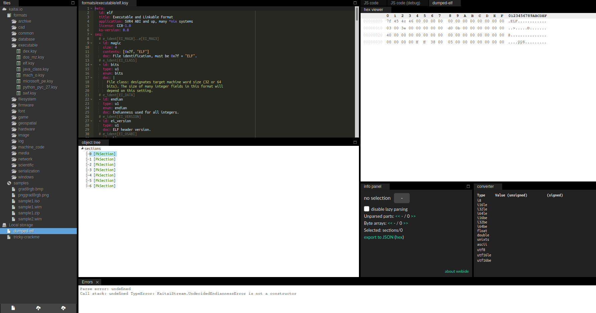

Unfortunately, this file also triggers an error in the Kaitai parser so we cannot easily view it in the tree view. This is a big drawback since we lose a strong tool. But we still have other options. 

[010Editor](https://www.sweetscape.com/010editor/) is another option for binary format inspection. It is primarily a hex editor, but it comes with `template` that describes various file formats and can show the parse result in a table view. Templates can be downloaded from [here](https://www.sweetscape.com/010editor/repository/templates/) or installed from within the program. 

010Editor also fails to parse it without issue. However, it can show partial parse results so we can at least see what is normal and what could be wrong. Besides, if no tool can parse it at all, we can still manually inspect it and find and defeat any tricks in it. The 010Editor parsing result looks like this: 

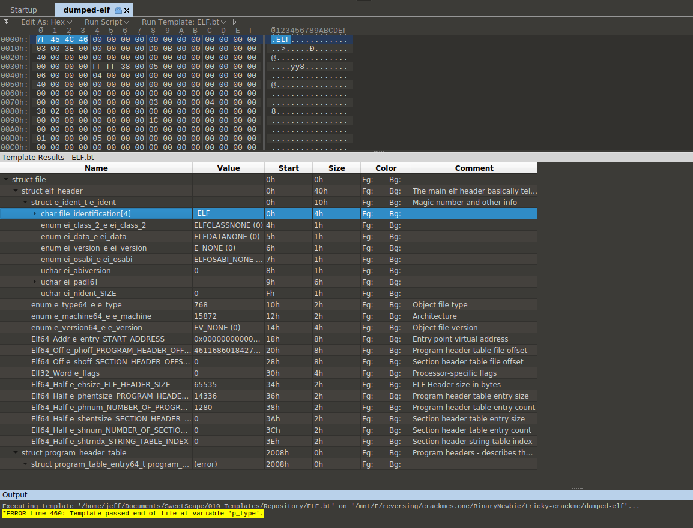

The ELF magic looks fine. Immediately after that, we find something unusual, the ELF class byte (offset 0x4) is set to none, whereas it should set to 1 for 32-bit programs and 2 for 64-bit programs. Cutter already showed us some code snippets in it and it is x64 code. So we set it to 0x2. At byte 0x5, the endianness is also not set, which is probably little-endian since it runs properly on my little-endian Linux system. Next, the EI_VERSION at byte 0x6 is set to 0x1 in most ordinary binaries. 

After we fix these three fields, BinaryNinja is now able to load it as ELF and find the entry point:

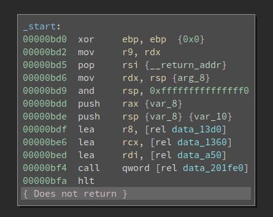

Not bad, but we are missing symbols. I have reversed lots of binaries on Linux so `data_201fe0` is actually `__libc_start_main` and `data_a50` is the main() function. After I define the function, it looks like this:

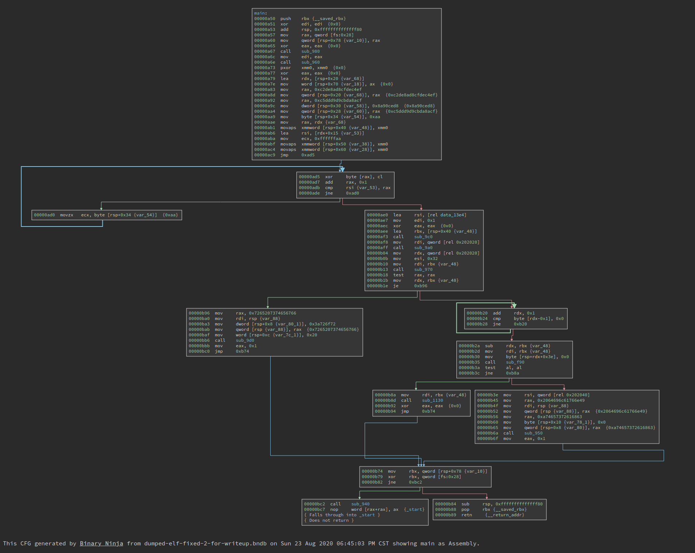

The complexity of the CFG is OK. But since we are missing all imported functions, we have no clue of what this program is doing. If i double click `sub_980`, it is essentially a jmp to a PLT function. 

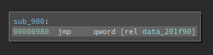

Which means it is an imported function. Had this binary not been tampered with, we should already know what it is. 

Since we have fixed the binary, 010Editor can parse it without any errors. We see that all of the section headers are removed, and the number of segments is also less than usual. 

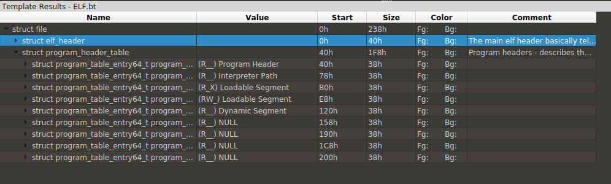

The readers might have heard of that section headers are not important for ELF file executions. Linux only uses information in segments to load the binary and kick off the execution. However, since sections typically exist (generated by compilers) and contain more information than the segments, many reverse engineering tools use information from sections to parse the binary. Now that the section headers are wiped out, they cannot function properly. 

There is a `e_shoff` field in the ELF header that points to the start of the section headers. Section headers, when they exist, are organized into an array and placed at the end of the binary. Of course, they do not have to be there -- as long as the `e_shoff` actually points to the start of it. In several obfuscated ELF binaries that I reversed, the `e_shoff` is wiped out but the section headers are left intact at the end of the file. For that case, it is easy to repair since we simply need to count how many sections do we have and find out the start of the array accordingly. 

However, for this particular binary, the `e_shoff` and the actual section headers are both wiped out. It is very hard to recover all the section headers since there are lots of information on it. 

Note, however, I am not saying the sections are wiped out. No, impossible. Only the section headers are gone. Sections still contain data that is crucial for the execution. And it is highly likely that they are not touched. Though we do not know the boundaries of each of them, so we cannot recover them. 

But here is a problem: if we cannot resolve the imports, how could the loader resolve them? The programs execute properly. So there must be a way!

We still have segments and the loader relies on segments to resolve imports. Do segments store the information at another place so it still works? Well, sections and segments overlap. We do not know where sections are since we do not have the section headers, but the segments contain offsets to useful information and can help the loader. Nevertheless, the information in segments is organized in a different format so existing tools do not parse them well. We can either reconstruct a part of the section headers so the analysis tool can parse the imports correctly, or we replace the loader by ourselves -- parse the imports directly. This is especially doable for Linux since everything is open-source.

It is noteworthy that there is a third approach -- debug the program and see where those stub function jumps into, so that we can resolve the imports semi-manually. I have used this previously for a PE challenge where the imported APIs are obfuscated. This is a small crackme and we do not have lots of them, so the workload is fine. However, when I try to run it in gdb, gdb fails to parse the binary too. It cannot find `__libc_start_main` so we cannot properly debug it. I would say gdb could do a better job but enhancing gdb right now is not an option for me. 

So I turned to another approach -- resolve the imports via a script. 


<!-- I also tried several other tools, e.g., file, readelf, 010Editor, and Kaitai, they all face some challenges in parsing the binary.  -->

## Non-lazy symbols

We will start with non-lazy symbols first. Non-lazy symbols are resolved by the loader at loading time. The first thing we need is the DYNAMIC segment. The segments are described in an array of `Elf64_ProgramHeader` in the ELF header. For this particular binary, it is the No.4 one inside the array. 

```
00000120      [0x4] = 
00000120      {
00000120          enum p_type type = PT_DYNAMIC
00000124          enum p_flags flags = PF_R
00000128          uint64_t offset = 0x0
00000130          uint64_t virtual_address = 0x201d58
00000138          uint64_t physical_address = 0x0
00000140          uint64_t file_size = 0x0
00000148          uint64_t memory_size = 0x0
00000150          uint64_t align = 0x0
00000158      }
```

We see that the DYNAMIC segment starts at offset `0x201d58`. It contains an array of structure `Elf64_Dyn`, whose definition is: 

```C
typedef struct
{
  Elf64_Sxword  d_tag;          /* Dynamic entry type */
  union
    {
      Elf64_Xword d_val;        /* Integer value */
      Elf64_Addr d_ptr;         /* Address value */
    } d_un;
} Elf64_Dyn;
```

Among the two fields, `d_tag` specifies the type of it. And depending on the value of `d_tag`, `d_un` could be either an address or an integer value. Some legal values for `d_tag` are:

```C
/* Legal values for d_tag (dynamic entry type).  */

#define DT_NULL     0       /* Marks end of dynamic section */
#define DT_NEEDED   1       /* Name of needed library */
#define DT_PLTRELSZ 2       /* Size in bytes of PLT relocs */
#define DT_PLTGOT   3       /* Processor defined value */
#define DT_HASH     4       /* Address of symbol hash table */
#define DT_STRTAB   5       /* Address of string table */
#define DT_SYMTAB   6       /* Address of symbol table */
#define DT_RELA     7       /* Address of Rela relocs */
#define DT_RELASZ   8       /* Total size of Rela relocs */
#define DT_RELAENT  9       /* Size of one Rela reloc */
#define DT_STRSZ    10      /* Size of string table */
#define DT_SYMENT   11      /* Size of one symbol table entry */
#define DT_INIT     12      /* Address of init function */
#define DT_FINI     13      /* Address of termination function */
#define DT_SONAME   14      /* Name of shared object */
#define DT_RPATH    15      /* Library search path (deprecated) */
#define DT_SYMBOLIC 16      /* Start symbol search here */
#define DT_REL      17      /* Address of Rel relocs */
#define DT_RELSZ    18      /* Total size of Rel relocs */
#define DT_RELENT   19      /* Size of one Rel reloc */
#define DT_PLTREL   20      /* Type of reloc in PLT */
#define DT_DEBUG    21      /* For debugging; unspecified */
#define DT_TEXTREL  22      /* Reloc might modify .text */
#define DT_JMPREL   23      /* Address of PLT relocs */
#define DT_BIND_NOW 24      /* Process relocations of object */
#define DT_INIT_ARRAY   25      /* Array with addresses of init fct */
#define DT_FINI_ARRAY   26      /* Array with addresses of fini fct */
#define DT_INIT_ARRAYSZ 27      /* Size in bytes of DT_INIT_ARRAY */
#define DT_FINI_ARRAYSZ 28      /* Size in bytes of DT_FINI_ARRAY */
#define DT_RUNPATH  29      /* Library search path */
#define DT_FLAGS    30      /* Flags for the object being loaded */
#define DT_ENCODING 32      /* Start of encoded range */
#define DT_PREINIT_ARRAY 32     /* Array with addresses of preinit fct*/
#define DT_PREINIT_ARRAYSZ 33       /* size in bytes of DT_PREINIT_ARRAY */
#define DT_SYMTAB_SHNDX 34      /* Address of SYMTAB_SHNDX section */
#define DT_NUM      35      /* Number used */
#define DT_LOOS     0x6000000d  /* Start of OS-specific */
#define DT_HIOS     0x6ffff000  /* End of OS-specific */
#define DT_LOPROC   0x70000000  /* Start of processor-specific */
#define DT_HIPROC   0x7fffffff  /* End of processor-specific */
#define DT_PROCNUM  DT_MIPS_NUM /* Most used by any processor */
```

There are many important information in this array. For example, there are six fields related to INIT and FINI, i.e., `DT_INIT`, `DT_FINI`, `DT_INIT_ARRAY`, `DT_INIT_ARRAYSZ`, `DT_FINI_ARRAY`, `DT_FINI_ARRAYSZ`. However, those relevant to the resolving of import functions are listed below:

```
00201d58  struct Elf32_Dyn _.dynamic[26] =  
00201d58  {
00201dd8      [0x8] = 
00201dd8      {
00201dd8          enum Elf64_Sxword d_tag = DT_STRTAB
00201de0          uint64_t d_ptr = 0x4e8
00201de8      }
00201de8      [0x9] = 
00201de8      {
00201de8          enum Elf64_Sxword d_tag = DT_SYMTAB
00201df0          uint64_t d_ptr = 0x2c0
00201df8      }
00201df8      [0xa] = 
00201df8      {
00201df8          enum Elf64_Sxword d_tag = DT_STRSZ
00201e00          uint64_t d_ptr = 0x113
00201e08      }
00201e08      [0xb] = 
00201e08      {
00201e08          enum Elf64_Sxword d_tag = DT_SYMENT
00201e10          uint64_t d_ptr = 0x18
00201e18      }
00201e28      [0xd] = 
00201e28      {
00201e28          enum Elf64_Sxword d_tag = DT_PLTGOT
00201e30          uint64_t d_ptr = 0x201f48
00201e38      }
00201e38      [0xe] = 
00201e38      {
00201e38          enum Elf64_Sxword d_tag = DT_PLTRELSZ
00201e40          uint64_t d_ptr = 0x168
00201e48      }
00201e58      [0x10] = 
00201e58      {
00201e58          enum Elf64_Sxword d_tag = DT_JMPREL
00201e60          uint64_t d_ptr = 0x788
00201e68      }
00201e68      [0x11] = 
00201e68      {
00201e68          enum Elf64_Sxword d_tag = DT_RELA
00201e70          uint64_t d_ptr = 0x680
00201e78      }
00201e78      [0x12] = 
00201e78      {
00201e78          enum Elf64_Sxword d_tag = DT_RELASZ
00201e80          uint64_t d_ptr = 0x108
00201e88      }
00201ef8  }

```

We can see that `DT_STRTAB` has value 0x4e8, which means the string table starts at offset 0x468. Also, the `DT_STRSZ` is 0x113, so the size of the string table is 0x113. This can be verified in the following image:

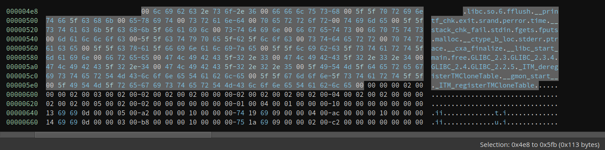

We can see many familiar names in it, e.g., `srand`, `time`, and `malloc`. These are the names of imported functions. Now what we need to figure out is how these are linked with symbols so that we can know which symbol corresponds to which name.

The next thing we should look at is the symbol table. `DT_SYMTAB` is 0x2c0, which means the symbol table starts at 0x2c0. `DT_SYMENT` is 0x18, which suggests there are 0x18 = 24 symbol entries. Interestingly, there are 23 entries, which I do not fully understand. If anyone has any idea on this, feel free to help me out.

Each symbol entry is an `Elf64_Sym`:

```C
typedef struct
{
  Elf64_Word    st_name;        /* Symbol name (string tbl index) */
  unsigned char st_info;        /* Symbol type and binding */
  unsigned char st_other;       /* Symbol visibility */
  Elf64_Section st_shndx;       /* Section index */
  Elf64_Addr    st_value;       /* Symbol value */
  Elf64_Xword   st_size;        /* Symbol size */
} Elf64_Sym;
```

Due to space limitation, I will only show the first three symbol entries here:

```
000002c0  struct Elf64_Sym data_2c0[23] = 
000002c0  {
000002c0      [0x0] = 
000002c0      {
000002c0          uint32_t st_name = 0x0
000002c4          uint8_t st_info = 0x0
000002c5          uint8_t st_other = 0x0
000002c6          uint16_t st_shndx = 0x0
000002c8          uint64_t st_value = 0x0
000002d0          uint64_t st_size = 0x0
000002d8      }
000002d8      [0x1] = 
000002d8      {
000002d8          uint32_t st_name = 0x9d
000002dc          uint8_t st_info = 0x12
000002dd          uint8_t st_other = 0x0
000002de          uint16_t st_shndx = 0x0
000002e0          uint64_t st_value = 0x0
000002e8          uint64_t st_size = 0x0
000002f0      }
000002f0      [0x2] = 
000002f0      {
000002f0          uint32_t st_name = 0xce
000002f4          uint8_t st_info = 0x20
000002f5          uint8_t st_other = 0x0
000002f6          uint16_t st_shndx = 0x0
000002f8          uint64_t st_value = 0x0
00000300          uint64_t st_size = 0x0
00000308      }
00000308      [0x3] = 
00000308      {
00000308          uint32_t st_name = 0x54
0000030c          uint8_t st_info = 0x12
0000030d          uint8_t st_other = 0x0
0000030e          uint16_t st_shndx = 0x0
00000310          uint64_t st_value = 0x0
00000318          uint64_t st_size = 0x0
00000320      }
```

The first entry is always all 0. So the first entry has index 0x1. Field `st_name` does not store the string itself. Instead, it stores the offset into the string table that we discussed earlier. Each name is null-terminated. Given the value 0x9d, we can find out that is `free`. `st_info` contains the symbol type that we will not cover in detail here. Now that we connect symbols with its name, we still have no idea which PLT entry corresponds to which symbol. And that is the last part of the mystery. 

There are two relocation tables. The first one is `DT_RELA` and it starts at 0x680 and has a size 0x108. The second one is `DT_JMPREL`. It starts at 0x788 and it has a size 0x168. Both of them are arrays of `Elf64_Rela` which is defined as follows:

```C
typedef struct
{
  Elf64_Addr    r_offset;       /* Address */
  Elf64_Xword   r_info;         /* Relocation type and symbol index */
  Elf64_Sxword  r_addend;       /* Addend */
} Elf64_Rela;
```

The first 4 entries are listed here:

```
00000788  struct Elf64_Rela _.rela.plt[15] = 
00000788  {
00000788      [0x0] = 
00000788      {
00000788          uint64_t r_offset = 0x201f60
00000790          uint64_t r_info = 0x100000007
00000798          int64_t r_addend = 0x0
000007a0      }
000007a0      [0x1] = 
000007a0      {
000007a0          uint64_t r_offset = 0x201f68
000007a8          uint64_t r_info = 0x300000007
000007b0          int64_t r_addend = 0x0
000007b8      }
000007b8      [0x2] = 
000007b8      {
000007b8          uint64_t r_offset = 0x201f70
000007c0          uint64_t r_info = 0x400000007
000007c8          int64_t r_addend = 0x0
000007d0      }
000007d0      [0x3] = 
000007d0      {
000007d0          uint64_t r_offset = 0x201f78
000007d8          uint64_t r_info = 0x500000007
000007e0          int64_t r_addend = 0x0
000007e8      }
000007e8      [0x4] = 
000007e8      {
000007e8          uint64_t r_offset = 0x201f80
000007f0          uint64_t r_info = 0x700000007
000007f8          int64_t r_addend = 0x0
00000800      }
```

Taking the first entry as an example, the `r_offset` is 0x201f60. Where is this address? Going back to the DYNAMIC segment, we see that `DT_PLTGOT` is 0x201f48. This means the PLT starts at 0x201f48. 

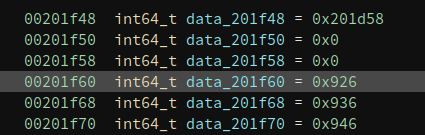

We know the first three entries of PLT have special uses so the first item the compiler tends to use is the fourth one. Now the last problem is which function does the first entry corresponds to. 

The secret is in the `r_info`, which has a value of 0x100000007. There are three macros related to it:

```C
#define ELF64_R_SYM(i)          ((i) >> 32)
#define ELF64_R_TYPE(i)         ((i) & 0xffffffff)
#define ELF64_R_INFO(sym,type)      ((((Elf64_Xword) (sym)) << 32) + (type))
```

The low dword is 7, which specifies the type of relocation entry. and the high dword is 1, which means that the current relocation entry corresponds to the no.1 entry in the symbol table. Remember the No.0 entry is always 0 and we already mentioned that the no.1 entry is `free()`, so we can rename it to `free` right now. 

This binary is small so I manually resolved all the names like this. But if the binary is large and has many import functions, it is also not hard to write a Python script to resolve them automatically. It looks like this after I finish them. 

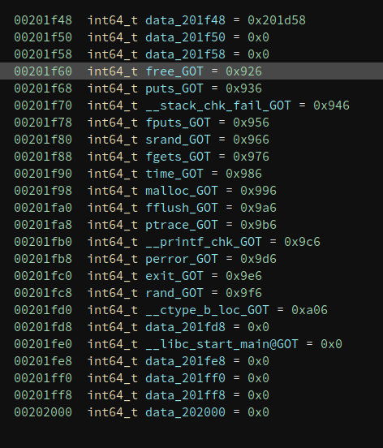

And we now know what is happening in `main()`.

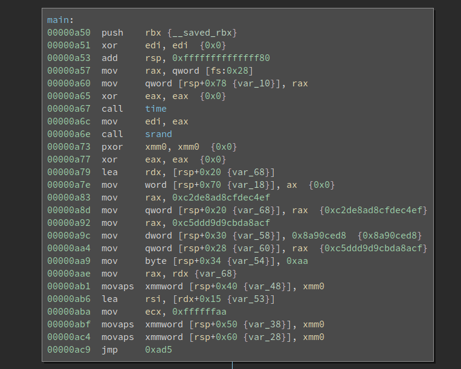

## Solve it, finally!

Not that we have passed the most difficult part of the challenge. We still have to reverse the algorithm and solve the challenge itself. The first thing I notice is there is a `ptrace` based anti-debug:

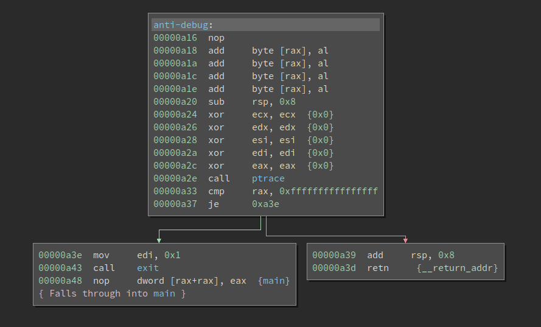

Since there is no integrity check on the binary, I simply patched to `Never Branch` so it never gets to the failure path. 

The next challenge is `gdb` cannot properly debug it. It cannot even find and set a breakpoint at `__libc_start_main`. Even if we use the actual address of _start, which is the entry point of the binary, it still malfunctions. I do not have even time to debug why gdb fails, but I managed to find a workaround. I patched an instruction (near the _start) to 0xcc (int3), so it will break and gdb manages to catch it (thx!), we can start debugging from there. 

The underlying algorithm is not complex so we will skip it here. 

## Lazy Symbols

Now that we have explained how non-lazy symbols are resolved. Many materials explain how lazy symbols are resolved. Note the way that the two types of symbols are resolved differently. Lazy symbols are not resolved in a slightly different way. We will recap how they differ and discuss what are some consequences. 

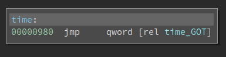

So the call to `time()` in the `main()` function actually first calls into a stub function. The qword at `time_GOT` is 0x986, and the code at 0x986 is:

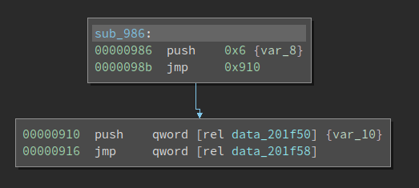

Now we see the `push 0x6` and the `jmp` which is covered in lots of writeups about PLT/GOT. 0x6 is also the index into the relocation table that helps the loader resolve the import. We all know that lazy-symbols are not resolved at load-time. When the program calls it for the first time, the index (0x6) is pushed onto the stack before the code gets to `_dl_runtime_resolve()`. Note this `push n` is ONLY used for lazy symbols. For non-lazy ones, the loader uses the information in `Elf64_Rela->r_info` to resolve the imports. By the time the import function is called for the first time, the value at `time_GOT` is already the actual address of time() in `libc.so` and NOT 0x986. So the code in the above screenshot is never executed. You can patch it to `int 3` to test it. However, for lazy symbols, where the `push n` plays a role, if we do the same patch, the program will crash during loading. 

To sum up, non-lazy symbols directly use the index in `Elf64_Rela->r_info` and lazy-symbols use index in the `push n` to the first index into the relocation table, and then use `Elf64_Rela->r_info` to continue the resolution. 

Thus, to obfuscate the binary, we can change the value of `push n` and make it point to a different symbol. Since it seems current tools all use `Elf64_Rela->r_info` to retrieve the index value into the symbol table. So there is an opportunity to create a binary that executes as expected, but cannot be properly analyzed by reverse engineering tools. I will update this writeup when I have a concrete example. 

For reverse engineering tools, the best way to defeat this obfuscation is to distinguish lazy/non-lazy symbols and parse the `push n` for lazy symbols and obtain the index accordingly. But this creates several issues since they typically do not only support x86/x64, they have to also support other architectures like ARM. There are going to be some nuances that inflate the code logic so it is not simple to do. 

## References

There are many references that I used during writing. Unfortunately, I did not mark it when I referenced them. Instead, I assembled a list and put it here:

- `elf.h` in Linux source code
- Book `"Learning Linux Binary Analysis"`
- [Understanding _dl_runtime_resolve](https://ypl.coffee/dl-resolve/)
- [ELF: dynamic struggles](http://michalmalik.github.io/elf-dynamic-segment-struggles)