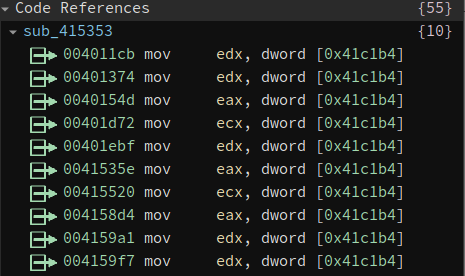
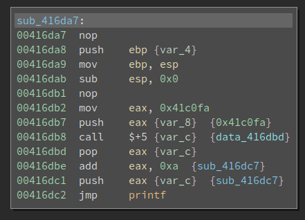
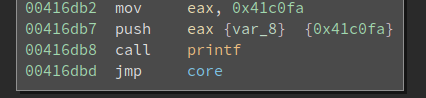
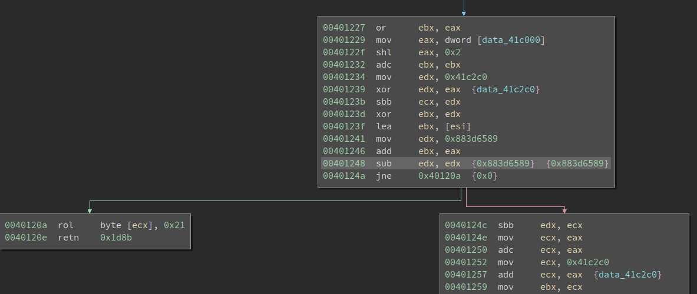
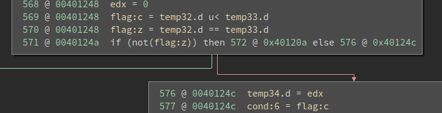
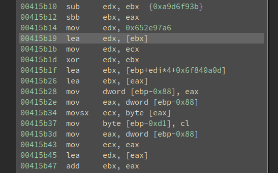
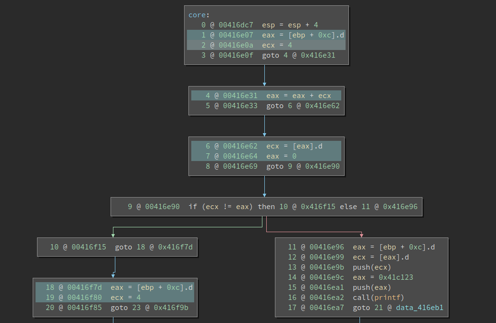
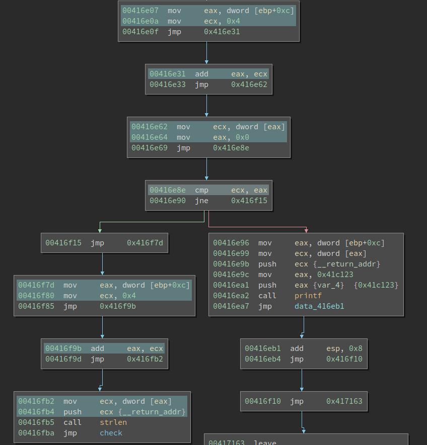

# Solving an Obfuscated Crackme with BinaryNinja and Triton

The last week's [challenge](https://yurichev.com/blog/58/) was created by [Dennis Yurichev](https://yurichev.com/). It is also hosted on [crackmes.one](https://crackmes.one/crackme/5ab77f6233c5d40ad448c9e4). The challenge is compiled by a modified [Tiny C Compiler (TCC)](https://bellard.org/tcc/) which obfuscates the generated code during compilation. We will cover the major techniques to deobfuscate the binary, followed by a quick analysis of the algorithm itself. 

## First Impression

The target ([keygenme4.exe](keygenme4.exe)) is a PE. The entry point looks like this: 


There are several things which we can notice easily: 

1. The basic block is quite long. 
2. It has excessive amounts of continuous arithmetic operations. 

1) is quite common for obfuscated code. Several obfuscation techniques inflate the code and make it hard to read. 2. is unique to this obfuscator. If we look at the following instructions closely, we notice it is first loading a constant into `eax`, does a series of arithmetic operations on it, and saving it to a variable. 

```
0041af0a  mov     eax, dword [data_41c1b4]
0041af10  shr     eax, 0x0
0041af13  shr     eax, 0x1
0041af16  xor     eax, 0xa8f3a9ca
0041af1c  shl     eax, 0x7
0041af1f  sub     eax, 0x5a041880
0041af25  mov     dword [ebp-0x14 {var_18}], eax
```

After we check the dword value at data_41c1b4, we can emulate the above code snippet and find out the final value of `eax`. It turns out to be 0. So the code is equivalent to:

```
0041af25  mov     dword [ebp-0x14 {var_18}], 0x0
```

`data_41c1b4` is a global variable. When we click on it, we can see all its cross-references. After browsing the list we find that the value is read a lot of time, but it is never written to. 



This means the value never changes. And sequence of instructions like the above one can be simplified to just one constant load. 

We will call this `convoluted constant load` later on. Not bad, we break one of the obfuscation! Well, not yet. We just understand how it works and solves it manually. But we need to solve them automatically. `Automation` is an important topic in deobfuscation. Often the obfuscation is not hard to understand, but solving them can be much harder. We will discuss how to tackle it later. 

## Hunting for Other Obfuscation Techniques

As we explore the binary, we can find the following obfuscation techniques. 

### Obfuscated Calls



0x41c0fa is the string to be printed by `printf`, which is nothing special. The next four instructions do the interesting stuff:

```
00416db8  call    $+5 {var_c}  {data_416dbd}
00416dbd  pop     eax {var_c}
00416dbe  add     eax, 0xa  {sub_416dc7}
00416dc1  push    eax {var_c}  {sub_416dc7}
```

After the `call $+5`, the `eip` becomes 0x416dbd. Meanwhile, the return address is pushed onto the top of the stack. Note the return address is also 0x416dbd. The following `pop, add, push` sequence would change the return address to `sub_416dc7` (which is also calculated by BinaryNinja). 

Now it executes `jmp printf`. Note this is a `jmp` so it does not push a return address onto the stack. `sub_416dc7` is still on the top of the stack. The string to be printed is right below it. In other words, this creates a fake call stack and it manipulates the return address so the code will continue execution from a different place (rather than the code below the printf). 

printf has no magic and it just prints the string. When the execution returns from the printf, the return address sub_416dc7 is popped from the stack and executed. In other words, the above code is equivalent to:

<!-- ```
00416db2  mov     eax, 0x41c0fa
00416db7  push    eax {var_8}  {0x41c0fa}
00416db8  call    printf
00416dbd  jmp     core
``` -->



This is not hard to deal with since the pattern is quite obvious. We will cover how to solve it later. 

### Opaque Predicate



Another abnormal thing we notice is the code has an excessive amount of branches. If we look at the code closely, we can see something like this:

```
00401248  sub     edx, edx  {0x883d6589}  {0x883d6589}
0040124a  jne     0x40120a  {0x0}
```

Thanks to the `sub edx, edx`, the zero flag is always set thus the jne never jumps. This is more obvious if we switch to the Low-Level IL (LLIL):



In other words, the branch is fake and the execution always gets to 0x40124c. We call this an `opaque predicate`. 

Opaque predicate is a well-known obfuscation technique that slows down reversers. When we reverse a piece of code, we often first get a grasp of the behavior of the code by looking at its layout (branches, loops, etc). Even beginners know to look for the critical branch that decides whether the code will print a "congratulation" or "sorry". 

Opaque predicate can be removed statically -- since they are opaque and one branch is always taken. However, in real-world, we can use some mathematical fact that is hard to be solved by a program. For example, for any integer `x`, this is always true:

```
x * (x + 1) * (x + 2) == 0 (mod 6)
```

If we know the set of opaque predicates the obfuscator use, then we can do a pattern matching. Otherwise, we might need to use z3 to prove it. The good news is, in this particular binary, the opaque predicates are quite easy to deal with. 

### Junk Code Insertion

Inserting junk code is another popular obfuscation technique. Check out the following code:



It is pretty messy -- which is a sign of useless code. And we see the register `edx` is overwritten before it is used. By "used" I mean it is not written to the memory or used to calculate other values. 

Junk code insertion is very easy to implement, and not always easy to solve. There is no silver bullet for it, though optimization is the general method to deal with it. Yes, optimization not only helps compiler generate faster code, it also helps remove unnecessary code. For the interested readers, this [script](https://github.com/JonathanSalwan/Tigress_protection) uses LLVM to remove the Trigress VM. 

However, in this writeup, we will take a different approach. We will leverage some property of the code generated by TCC and solve it by backward taint analysis.

## Writing a deobfuscator

Before I discuss the details of the deobfuscator, I would like to first address the availability of the obfuscator source code. We all know TCC is open-source. And Dennis provided the [patch file](http://conus.info/stuff/tcc-obfuscate/tcc-0.9.25-diff). So we can look at how the obfuscated binary is generated. This is of course a good thing since we can learn from the obfuscator. And I do recommend that everyone read it since it can show a relatively simple and lightweight way of implementing an obfuscating compiler. 

However, this also introduces a problem: in the real-world, we typically do not have the source code for the obfuscator. So we should avoid using too many details from it. Though I still use some -- but I try to limit them as few as possible. 

Writing a deobfuscator is harder than understanding the obfuscation. I was once hesitant to start tackling this since I know it is going to take a few days. And now when I look at the code I have written, I still remember the hardship that I encountered. But I have succeeded! This is something that I am proud of. 

We probably cannot cover every detail of the deobfuscator. It is only 500 LoC but discussing every bit (as well as the reasoning behind it) is beyond the scope of this writeup. But I will cover the major highlights. 

### Planning

Writing a good deobfuscator needs some planning before actual coding. The first thing we need to consider is tooling. Binary analysis requires lots of tools to proceed. How do we get the disassembly? What is the processing pipeline? 

In this writeup, I use BinaryNinja as the primary tool. It has a powerful Python API so it is quite easy to access the disassembled functions, basic blocks, assembly lines, etc. Later I also used Triton for backward taint analysis, which allows me to remove junk code quite effectively. 

The goal is simple: produce deobfuscated code. Note, however, one hurdle here is we do not have the ground truth for the obfuscated binary. As a result, we need to write the code, see its result in action, and make modifications and adjustments accordingly. When I deal with the opaque predicate, once my assumption was too wide and the deobfuscated code is empty. Then I have to go back and examine every branch the tool patched out and see which one is wrong (and should not be wiped out). One thing I did is to write a simple test C program, produce both the original binary and an obfuscated binary, and then test my tool on it. This allows me to fix several bugs faster. 

Automation is the result we want. However, we also need to make some compromise on this. Ideally, our program should take the binary as input and produce a deobfuscated one. However, I found there are too many corner cases so I decided that my tool will process one basic block a time. This allows me to verify if the result is correct. Later on, I enhanced it to process a function a time  -- just iterate over the basic blocks in a function and process them one by one. Even this sometimes causes problem and I have to go back to process basic blocks one by one. The good part is my script is pretty robust that almost never needs any manual fixes. 

### The Skeleton of a BinaryNinja Plugin

BinaryNinja allows a plugin to register a callback on an address. 

```Python
PluginCommand.register_for_address("Deobfuscate",
                                   "Remove tcc",
                                   bootstrap)
```

`bootstrap` is the function that gets called every time we click the `Deobfuscate` context menu. It is just a wrapper around the `simplify_bbl_handler`:

```Python
def simplify_bbl_handler(bv, addr):
    bbl = bv.get_basic_blocks_at(addr)[0]
    instrs_to_include = simplify_bbl(bv, bbl)
    bv.begin_undo_actions()
    nop_excluded_instrs(bv, bbl, instrs_to_include)
    solve_load_bbl(bv, bbl)
    bv.commit_undo_actions()
```

We get the basic block at the current address by `bv.get_basic_blocks_at()`. Then we start the real deobfuscating. Note we also add undo actions which is quite handy during development -- since we need to frequently change the code and see its result.

### Solving Convoluted Constant Load

The convoluted constant load is the first obfuscation technique we discussed. And it is used a lot across the binary. It is not hard to solve since its operations are simple. The problem is we need to locate it in the binary -- where it starts and where it ends. This is trivial for a human reverser, but it is not easy for a program. 

The implementation is in the function `solve_load_bbl()` in the [script](solution/de-obfuscate/de-obfuscate.py). The code is long so I cannot show it here. It does some pattern matching. It looks for consecutive arithmetic operations (`'add|sub|shl|shr|xor'`) on registers `['eax', 'ebx', 'ecx', 'edx']`. This might not be the `best` solution, but it works. We have to make some compromise since it is very hard to write the best code for a deobfuscator, which deals with messy things. 

After discovering the pattern, it emulates the operations:

```Python
def solve_load_ops(bv, ops):
    val = 0
    for opcode, operand in ops:
        if opcode == 'mov':
            addr = int(operand, 16)
            val_bytes = bv.read(addr, 4)
            val = struct.unpack('<I', val_bytes)[0]
            print(hex(val))
        elif opcode == 'add':
            val = (val + int(operand, 16)) & 0xffffffff
        elif opcode == 'sub':
            val = (val - int(operand, 16)) % (1 << 32)
        elif opcode == 'xor':
            val = val ^ int(operand, 16)
        elif opcode == 'shl':
            val = val << int(operand, 16)
            val &= 0xffffffff
        elif opcode == 'shr':
            val = val >> int(operand, 16)
        else:
            print('unknown operation: %s' % opcode)

    return val
```

After we calculate the final load value, we need to patch the code, which is super convenient in BinaryNinja. 

### Solving Obfuscated Calls

The obfuscated call needs to be restored. Note the obfuscated code has `jmp printf` in it, but we need to change it to `call printf`. And then add a `jmp` to the next function.

```Python
def solve_push_jmp(bv, func):

    for bbl in func.basic_blocks:
        if bbl.instruction_count < 5:
            continue
        
        disassembly_text = bbl.get_disassembly_text()
        if str(disassembly_text[-5]).startswith('call    $+5') and \
            str(disassembly_text[-4]).startswith('pop     eax') and \
            str(disassembly_text[-3]).startswith('add     eax, 0xa') and \
            str(disassembly_text[-2]).startswith('push    eax') and \
            str(disassembly_text[-1]).startswith('jmp'):

            patch_addr = disassembly_text[-5].address
            print('push_jump at: 0x%x' % patch_addr)

            jmp_addr = disassembly_text[-1].address
            callee_offset_bytes = bv.read(jmp_addr + 1, 4)
            caller_offset = struct.unpack('<i', callee_offset_bytes)[0]
            callee_addr = jmp_addr + caller_offset + 5

            dis = 'call 0x%x' % callee_addr
            inst_bytes = arch.assemble(dis, patch_addr)
            bv.write(patch_addr, inst_bytes)
            
            # this sequence is 15 byte long
            return_addr = patch_addr + 15
            jmp_addr = patch_addr + len(inst_bytes)
            dis_jmp = 'jmp 0x%x' % return_addr

            inst_bytes = arch.assemble(dis_jmp, jmp_addr)
            bv.write(jmp_addr, inst_bytes)
```

We need to do some math to calculate the `callee_addr`, `return_addr`, and `jmp_addr`. Once we finish this the control flow is much better since we now know which functions get called. 

### Solving Opaque Predicate

BinaryNinja already has a [plugin](https://binary.ninja/2017/10/01/automated-opaque-predicate-removal.html) for patching opaque predicates. It relies on the lifted LLIL to see if the flags used in the conditional jump can be deduced from the preceding code, and patch it if so. 

However, it does not suit my need because it does not take care of the convoluted constant load. Have a look at the following code:

```
00401172  mov     eax, dword [data_41c000]
00401178  mov     ecx, dword [data_41c1ac]
0040117e  xor     ecx, 0x32744b9b
00401184  shl     ecx, 0x2
00401187  shl     ecx, 0x4
0040118a  sub     ecx, 0x63fa1799
00401190  shr     ecx, 0x2
00401193  xor     ecx, 0x6a18d496
00401199  sub     ecx, 0x756243af
0040119f  cmp     eax, ecx
004011a1  jge     0x401516
```

The `eax` is loaded directly from the memory, and `ecx` is also a constant. So the result of the comparison is deterministic. However, LLIL does not squash these arithmetic operations so it does not know this is an opaque predicate. 

So I wrote my opaque predicate patcher. Here I read the source code of the obfuscator and found out that it only inject two types of opaque predicates: the first one is the `sub-and-jump` and the second is `xor-and-jump`. Both are quite easy to find. Then I just search for sub/xor instruction, whose two operands are the same, and it is followed by a conditional jump. If found, I patch it accordingly. 

```Python
def is_opaque_predicate(instr):

    tokens = instr.tokens
    if tokens[0].text == 'xor' and tokens[2].text == tokens[4].text:
        return True
    if tokens[0].text == 'sub' and tokens[2].text == tokens[4].text:
        return True   
    return False

def solve_opaque_predicate(bv, func):

    for bbl in func.basic_blocks:

        # jne to self
        if bbl.instruction_count == 1:
            instr = bbl.get_disassembly_text()[0]
            if instr.tokens[0].text.startswith('jne'):
                bv.never_branch(instr.address)  
            continue

        instrs = bbl.get_disassembly_text()

        try:
            instr1, instr2 = instrs[-2 :]
        except:
            print('error at: 0x%x' % bbl.start)

        if is_opaque_predicate(instr1):
            if should_patch_to_always_branch(instr2):
                log_info('always branch at: 0x%x' % instr2.address)
                bv.always_branch(instr2.address)
            elif should_patch_to_never_branch(instr2):
                log_info('never branch at: 0x%x' % instr2.address)
                bv.never_branch(instr2.address)
```

A careful reader should already find that I made a mistake here. On the one hand, after I read the source code I find there are only two types of opaque predicates; on the other hand, I think the conditional shown above (`0040119f  cmp     eax, ecx; 004011a1  jge     0x401516`) is also opaque. The problem is this is a `cmp` followed by `jge`, which is not opaque at all! 

The problem is the `00401172  mov     eax, dword [data_41c000]`. This is not a convoluted constant load; it is just a regular variable load! The value of `dword [data_41c000]` could change and this is a meaningful branch. After I realized this, I went back to change the code that solves the constant load: it has to have two operations at least. 

### Solving Junk Code

Junk code removal is the hardest part of this binary. It is not the most prominent technique used in it, but it does require a significant amount of work to solve. Junk code is easy to recognize for human reverser: it often contains a lot of meaningless/weird combinations of instructions. But this does not help a program to recognize them. 

As I mentioned, simplification is probably the `right` way to do it. But it also requires a huge amount of work. I looked at the generated assembly and found one property of TCC can help us solve it more easily. This involves compiler theories but I will keep it as simple as possible. 

TCC is `tiny` so it does not do a lot of optimization on the generated code. The [email list](https://lists.gnu.org/archive/html/tinycc-devel/2006-09/msg00028.html) writes:

```
TinyCC compiles every statement on its own. After every line of code,
values in registers are written back to the stack. And even if the next
line uses the variables that can still be found in registers, they are
read again from the stack.
```

This means, for TCC emitted code, if a value is calculated (and held in register) but not written back to the memory, then it is to be discarded. Though we do not necessarily see the register holding the value being over-written. This allows us to remove junk code on a basic block level rather than a function level, which is a lot easier to implement. 

Note, however, the above statement is not true for other compilers, e.g., gcc. Gcc generates code that uses a register to hold the loop counter `i`. The value is never written back to the memory inside the loop. For code like that, it is harder to deduce if a value is used later or not. 

The idea of the simplification is to pick all the useful instructions from a basic block. We start from instructions that write to the memory. And we do backward taint analysis on all of them to get a set of instructions that affect the final value written to the memory. We do this repeatedly until no new instructions are added. Then we get all the useful instructions. Finally, we remove all the useless instructions (junk code). 

The code is in `simplify_bbl()`. It is quite long so I do not post it here. [Triton](https://triton.quarkslab.com/) does the taint analysis. The recursion part is the most difficult to write. 

This method will be voided if the obfuscator writes the junk value into the memory. However, it is also harder to implement since the obfuscator authors need to find a safe place to write to. 

One question puzzles me for a long time until I read the source of the obfuscator. How does the junk code inserter make sure that it does not accidentally destroy some useful register value? For example, when it writes to `edx`, is it sure that `edx` does not hold any value that is used later? The answer is, TCC uses value stack (vstack) to keep track of values. And the obfuscator avoids writing to any registers in the vstack. The relevant code is:

```C
int is_reg_in_vstack (int r)
{
    SValue *p;

    for(p=vstack; p<=vtop; p++)
        if (r==((p->r)&0xFF))
            return 1;

    return 0;
};
```

### Nop-ing Out Useless Instructions

We almost succeed! We have handled all the obfuscation techniques. The last step is to remove those junk code (as well as some residue of other obfuscations). We can simply `nop` them, but then it creates looooong nop slides which make the code hard to read. Moving the remaining code to make it compact is non-trivial. It affects relocation, inline data, etc. Later, I learned (thx Jordan!) that switching to LLIL automatically removes these nops, as shown below:



However, when I approach the problem by myself, I found this is seldom discussed in deobfuscation literature so I came up with my own solution. 

We still first patch the junk code with `nop`. Since a `jmp` is only 5 bytes long, if there is a nop-slide that is longer than 5 bytes, we create a `jmp` that directly jumps to the end of the nop slide. The logic is implemented in `nop_excluded_instrs()`. The result does not look perfect, but it is already much more readable:



It first checks if argv[1] is 0. If so, it prints an error message. If not, it calls `strlen` on it and jumps to another function, which I named `check`. 

## Analyzing the algorithm

Finally, we get a clean binary that can be analyzed. The algorithm itself is not trivial and it requires some patience. It is probably a level 3 crackme if no obfuscation is applied. Though we will only cover the most important pieces of it. 

Interestingly, the deobfuscated binary still has other obfuscations. The most prominent one is the buffer is processed in 16 functions. Each function takes care of 8 bytes of the buffer. the functions are functionally identical but it is not organized into a loop. The first function will call the second, the second will call the third, etc.

The key must be 128 bytes long. The buffer is first decrypted using a CBC mode XOR. The key is 16 DWORDs calculated dynamically. We do not care about how the key is calculated; we just need to dump it once the programs calculated it. 

The decrypted buffer contains the serial number, user name, enabled feature sets, and expiration date. At the end of it, there is a checksum value. The checksum is calculated at sub_415353. One has to be familiar with the calculation of crc32 to understand this function. This is calculating a crc32 of the input buffer using magic value 0xedb88320 (see address 0x415747). 

Finally, we arrived at the keygen script:

```Python
import struct 

def crc32(s, init_val = 0, final_xor = 0):

    poly = 0xedb88320
    crc = init_val
    for c in s:
        if type(c) == str:
            asc = ord(c)
        else:
            asc = c

        asc ^= 0xffffffff
        crc ^= asc

        for _ in range(8):
            eax = crc & 1
            var_c_1 = (-eax) % 0xffffffff

            var_8 = crc >> 1
            var_c_1 &= poly

            crc = var_8 ^ var_c_1

        crc ^= 0xffffffff

    crc ^= final_xor   
    return crc  

def transform_back(buffer):

    rngs_vals = [
        0x10D88067, 
        0xBC16D3D5, 
        0xE7039A64, 
        0x39EC8A6D, 
        0xFF09B4BF, 
        0xF828DB76, 
        0x8BE40C8E, 
        0xF7AA583E, 
        0x60858E23, 
        0xE487F5A3, 
        0x39A57B89, 
        0xB006573E, 
        0x79609807, 
        0x620AD108, 
        0x5CD86398, 
        0x6CA94B51
    ]
    var_0x8c = 0

    ints = struct.unpack('<' + 'I' * 16, buffer)
    restored_ints = []

    for i in range(16):
        restored_int = ints[i] ^ rngs_vals[i] ^ var_0x8c
        restored_ints.append(restored_int)
        var_0x8c = restored_int

    return restored_ints

def main():

    name = 'jeff'
    sn = 0x12348765
    feature = 0x123
    expire_year = 0x2981
    expire_month = 0x34
    expire_date = 0x12

    buffer = name + '\x00' * (32 - len(name))
    buffer += struct.pack('<I', sn)
    buffer += struct.pack('<I', feature)
    buffer += struct.pack('<H', expire_year)
    buffer += struct.pack('<B', expire_month)
    buffer += struct.pack('<B', expire_date)

    buffer += '\x00' * 16

    crc = crc32(buffer)
    buffer += struct.pack('<I', crc)
    print(buffer.encode('hex'))

    restored_int = transform_back(buffer)

    key = ''
    for val in restored_int:
        key += '%08x' % val
    
    print('key: ')
    print(key)


if __name__ == '__main__':
    main()
```
<!-- 76bee50dcaa836d82dabacbc144726d1eb4e926e13664918988245966f281da81d9914eef91ee06ed28fb2666289e5581be97d5f79e3ac57253bcfcf254ff9d4 -->
An example run looks like this:

```
>keygenme4.exe 76bee50dcaa836d82dabacbc144726d1eb4e926e13664918988245966f281da81d9914eef91ee06ed28fb2666289e5581be97d5f79e3ac57253bcfcf254ff9d4
Yonkie's keygenme#4 <dennis@conus.info>
licensed name=jeff
sn=12348765
featureset=0123
expiration=12342981
```