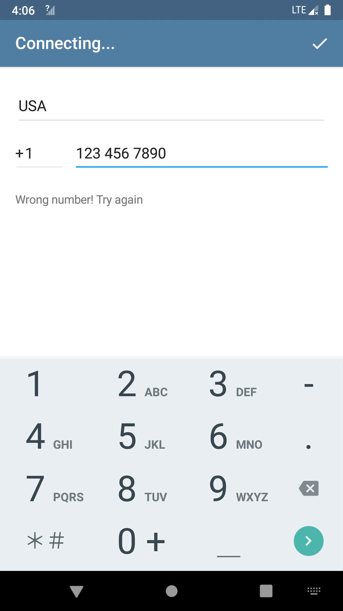
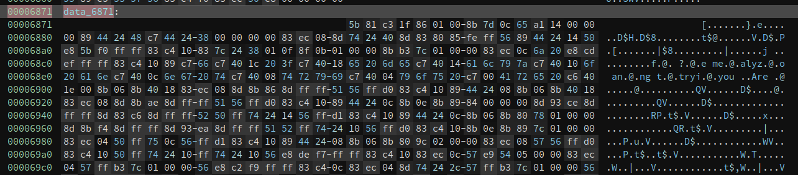
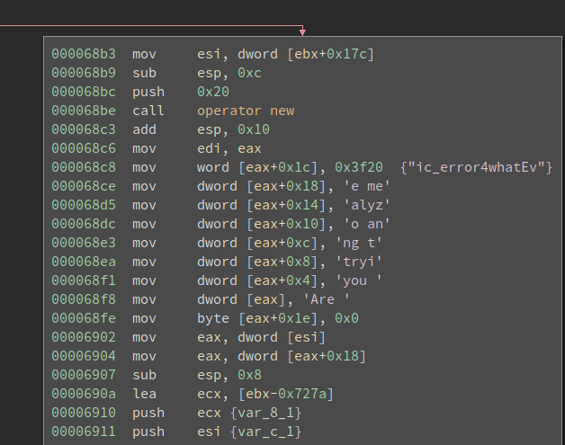
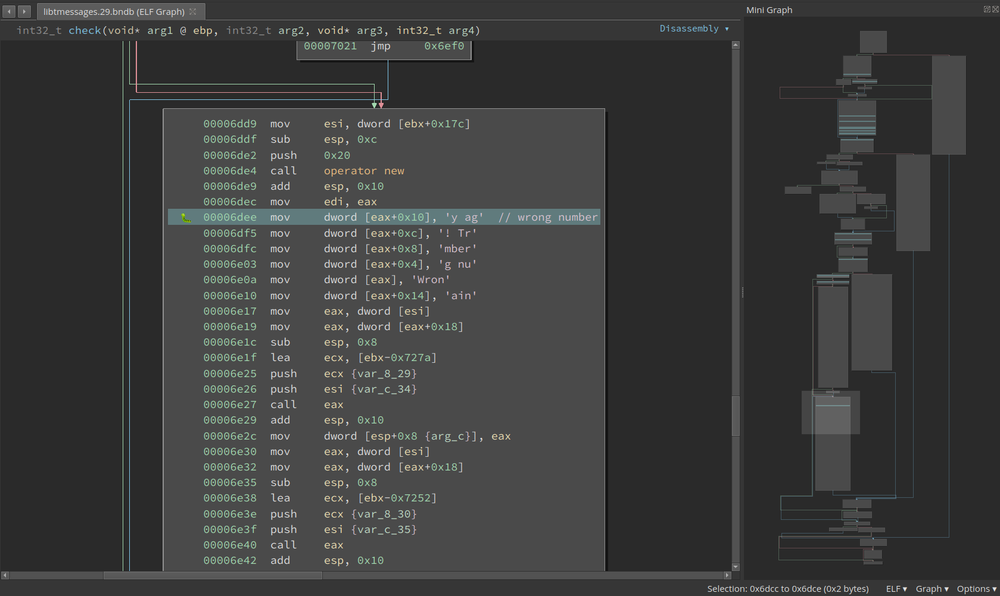
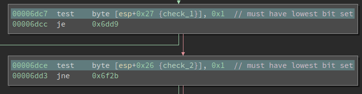
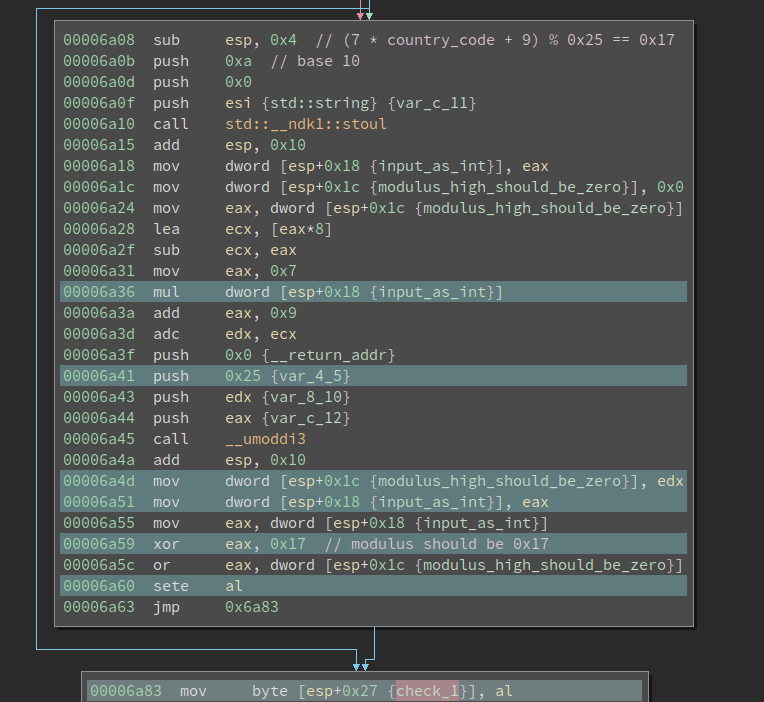
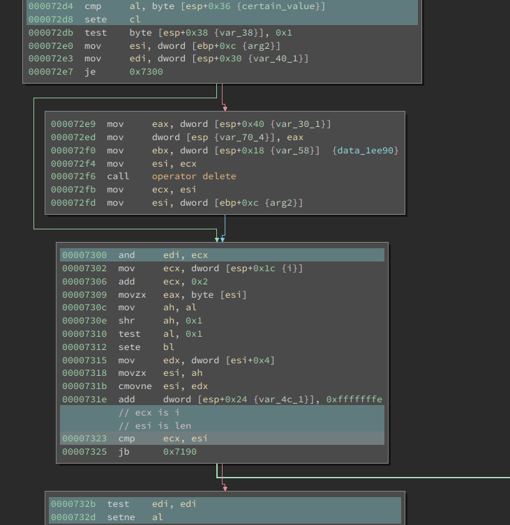
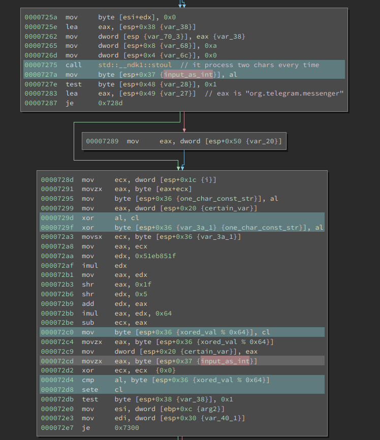

# Debugging and Solving an Android Challenge

Our first challenge is an Android challenge that features native library reverse engineering and debugging. Since the algorithm itself is not very complex, in this writeup I will cover the major steps to set up an Android debugging environment. I will also share some of my thoughts as we progress. 

## First Impression

The [challenge](https://blog.quarkslab.com/android-challenge.html) is created by Quarkslab. The **crackme-telegram.apk** is ~25MB in size which is larger than a typical crackme. One of the challenges in real-world reverse engineering is the huge size of the binary. There are too many possible places to hide the crucial code so even finding it is non-trivial in the first place. 

Unzipping the apk gives us a folder that has **classes.dex** and sub-folder **lib** in it. The code for an Android app can be either in the .dex file or the native libraries. the .dex file is typically produced from Java whereas the native libraries are mostly complied from C/C++. And they require different reverse engineering skills. Nevertheless, here I want to share a heuristic: **if an android crackme has native libraries, almost certainly the important code sits in these  libs.** Well, this is not 100% reliable and the situation could change since I publish this, but it works very well for now.

## Creating an AVD and Running the App

I do not have an Android phone or tablet so I need to run it in an emulator. There are many available Android emulators. In this writeup, I will use the official [Android Studio](https://developer.android.com/studio/). This crackme comes with both Arm and x86 versions of the native library, so we can run it in an x86 AVD (Android Virtual Device). Otherwise, I would have to use the Arm CPU AVD, which also works but runs slow on my Intel CPU. 

Creating an AVD should be quite straightforward following this [document](https://developer.android.com/studio/run/managing-avds). I got one with API 28 and x86 CPU. Once we launch the app, it prompts us to register with a phone number:



If we randomly input a phone number, we will be greeted by an error message. So this is already the main crackme. We need to find a special phone number (along with the country code) that is accepted by the app.

## Finding the Code

As always, we need to first locate the code which does the verification. One clue is the error message itself: **Wrong number! Try again**. This string can be found in the libtmessages.29.so. However, there are no Xrefs to it. Now there are several possibilities: 1. the string will be used but the code is obfuscated so my disassembler does not find a reference to it; 2. the string is not used and the code is somewhere else. I continued to search in class.dex, libtmessages.28.so, and also used [Apktool](https://ibotpeaches.github.io/Apktool/) to unpack the resources.arsc. Nothing else can be found. 

I do not want to create the illusion that I **systematically** find the verification function. Actually, I took some detous here. I reversed the class.dex and libtmessages.28.so for a while without success before I tried the libtmessages.29.so. This is indeed quite common in reverse engineering. Going back to the libtmessages.29.so, I had a look at the JNI_OnLoad() which has some related stuff but does not have the verification function. I checked the functions before and after the JNI_OnLoad() to see if there are any interesting functions. The logic is compilers tend to arrange the functions close to each other in the source code also adjacent to the generated binary. So there is a chance the important function is near the JNI_OnLoad(). 

I spotted the **data_6871** that sits right after the function. It starts with 0x5b81, which looks like code for me. 



Then I defined a function here and it is real code. It seems innocent at first look, but I quickly noticed that it is preparing a constant string on the stack: 



```
Are you trying to analyze me?
```

It looks like a message related to anti-debugging -- we might see this while debugging the app. Remember we are not yet sure whether this is related to the verification, so it is worthy to debug it now and see if this function is called. 

## Setting up Debugging

Simply put, debugging an android app is a remote debugging scene. We run the **gdbserver** on the phone (either an emulator or a real one) and attach it to the target process. And then we launch **gdb** on our computer and connect to the remote target. After that, there is no difference between debugging locally and remotely. 

An android app may run inside a Dalvik VM. However, the VM is just a regular process and can be debugged like any other processes. Furthermore, the native libraries are directed loaded into the process memory space so we can also debug that. 

We first need to download the [Android NDK](https://developer.android.com/ndk/) since we need the prebuilt gdbserver in it. The NDK is large and we do not need other things in it (for debugging purpose). However, it is better than randomly searching on the Internet for it -- it may not work properly inside the AVD. 

The gdbserver can be found in the ```android-ndk-r21b/prebuilt/android-x86/gdbserver```. Note I have a x86 AVD so I need the x86 version of it. First I push it to the device:

```
$ adb push ./android-ndk-r21b/prebuilt/android-x86/gdbserver /system/bin/
```

After that, I launch the app on the device. Then On my computer, I spawn an adb shell by running:

```
$ adb shell
```

The app is called **telegram** so I run the following command to find the PID of the target process by running:

```
# ps -A | grep telegram                                                                   
u0_a80        4165  7934 1562976 153292 ep_poll      e9897b59 S org.telegram.messenger
```

Note: I use ```$``` for any command to be executed in the host shell and ```#``` for anything inside the adb shell. 

The PID of our target is 4165. The command to attach gdbserver to the process is:

```
# gdbserver --attach host:port PID
```

In my case, I use:

```
# gdbserver --attach localhost:12345 4165
```

Now the gdbserver will attach to the process with PID 4165 and listen on port 12345 for remote connection. Meanwhile, the app will hang. 

We need to set up a port forwarding before connecting to it. This is because the gdbserver is listening on the port 12345 of the device, not our host computer. 

```
$ adb forward tcp:12345 tcp:12345
```

This will forward the port 12345 on the host to the port 12345 on the device. 

Now launch gdb on the computer and attach to it:

```
pwndbg> target remote localhost:12345
```

If everything works fine gdb should be printing a lot of information about the remote target. This might take a while and eventually, it should stop and ask for your input. The prompt starts with ```pwndbg>``` because I installed the pwngdb enhancement, which makes gdb more usable. 

The next thing to figure out is the base address of the loaded libtmessages.29.so. 

```
pwndbg> info sharedlibrary
From        To          Syms Read   Shared Object Library
// many lines omitted
0xc9b69000  0xc9b6eaf7  Yes (*)     target:/data/app/org.telegram.messenger-o_d807FF7eGAXMhf5s3qqQ==/oat/x86/base.odex
0xc9406570  0xc9406830  Yes (*)     target:/data/app/org.telegram.messenger-o_d807FF7eGAXMhf5s3qqQ==/lib/x86/libtmessages.29.so
0xc8896400  0xc8f70f71  Yes (*)     target:/data/app/org.telegram.messenger-o_d807FF7eGAXMhf5s3qqQ==/lib/x86/libtmessages.28.so
0xc7d329b0  0xc7d36ea5  Yes (*)     target:/vendor/lib/hw/gralloc.ranchu.so
(*): Shared library is missing debugging information.
```

We can see the address of libtmessages.29.so is 0xc9406570. Interestingly, the address reported by **info sharedblibrary** is the address of the **.text** section, which is not very convenient for rebasing. But it is fine since we can calculate it manually.

In BinaryNinja we can see the start of the .text is at 0x5570, while the start of the function is at 0x6871. We now the offset of the remains the same, so the actual address to set the breakpoint is:

```
>>> hex(0xc9406570 + (0x6871 - 0x5570))
'0xc9407871'
```

. Then we rebase it in BinaryNinja and we now the address of that. 

```
pwndbg> b *0xc9407871
Breakpoint 1 at 0xc9407871
pwndbg> c
Continuing.
```

Now, give a random phone number and hit enter on the phone. And the breakpoint hits! We find the verification function!

## Solving the Country Code

The function is medium-sized and we need to have a big picture of it before plunging into lines of assemblies. Near the bottom of the function, we see the string "Wrong number" being created in a buffer:



So we need to avoid this basic block. Scrolling up a little bit and we find two checks must be satisfied:



These are testing if the lowest bit is set. However, if we go further upward we can find that both **check_1** and **check_2** are booleans and they represent whether a check is satisfied. For check_1, we have the following block:



We see a string input is passed into function **std::__ndk1::stoul** and converted to an integer using base 10. Then **7 * int + 9** is calculated and the result is fed into function **__umoddi3**. I have seen **__umoddi3** before so I quickly figure out the divisor is 0x25. In fact, **__umoddi3** calculates 64-bit unsigned modulus. This is a 32-bit binary so it has to use two registers to hold 64bit values. The **edx** pushed onto the stack is the higher 32 bits of the dividend; the **eax** is the lower 32bits. If I have not seen it, I can also figure it out by debugging the code and observe the input and output for it. The modulus is returned as **edx:eax** too. 

We want variable **check_1** to be 1, so we must set it at 0x6a60. To ensure the **ZF** is set when it gets to 0x6a60, the eax must be 0x17 and the edx must be 0. This means the modulus must be equal to 0x17. 

A quick debugging veries the input string is the country code we input. So the constaint here is: 

```
(7 * country_code + 9) % 0x25 == 0x17
```

A simple script to print the accepted coutry_code is as follows:

```Python
for coutry_code in range(999):
    if  (7 * coutry_code + 9) % 0x25 == 0x17:
        print(coutry_code)
```

We know there are many values that satisfy the above equation, but only one among them is a valid country code. It is +39, which is the code for Italy. 

## Solving the Phone Number

Below the country code check, we can find the check for the phone number. At 0x6c6f it calls into another medium-sized function, which is probably the check function. It looks like this: 


It is not immediately obvious what this function does. Though from the first few basic blocks we can observe the **std::string** being used and the valid length is probably 0x16. Remember the correct phone number is not necessarily a phone number at **al** and it does not have to have a length that looks like a phone number (e.g., 10 digits for the U.S.). 

To approach a function like this, there are two methods. The first way is to check how is the return value calculated and back-slice it and do taint-analysis in the brain. From the previous analysis we now this function should return 1 in **eax**. We can go back from the last instruction that touches **eax** and see what is the way to set it to 1. 

Besides, we see there is a loop in the lower-right side of the mini graph. Loops can give us a lot of information about what is happening. My way to reverse a loop is to identify the iteration variable (similar to **i** in C code), and see what is the initial value, final value, and stride. Or more generally speaking, what is the exit condition and what is the update rule. This lets us know how many times this loop is going to be executed. 

Then we should get into the loop body and analyze it. This lets us know what is done in one iteration. These two combined tell us what the loop is doing as a whole. 

It is hard to include every step I took to reverse this loop, but let me describe the major steps. 
First thing first, there are many ways to exit this loop, but the exit at 0x7325 is the only place where the return value of this function can be 1. Above it, we see **cmp ecx, esi**, which is probably comparing the iterator with the final value. But which one is the iterator? 



In many cases, we can figure out by looking at the code, but for this one, I am not so sure. Never mind, we can debug it. I set a breakpoint at 0x7323 and send an input with length 0x16 (if the length is wrong, the execution never enters the loop). In the first iteration **ecx** is 0 and **esi** is 0x16; in the second iteration **ecx** is 2 and **esi** is 0x16. 

So, it looks like ecx is **i** and esi is the final value 0x16. Going up a little bit and at 0x7306 we see the i is incremented by 2 each time. So this loop probably processes two bytes of the input one time. 

Now it is time to analyze one iteration. We want the code at **0x732d** to set al, then **edi** must not be 0. At **0x7300** there is a **and**, so ecx must not be 0. **ecx** is updated at 0x72d8, where we have a **cmp** before it. So to have 1 as the return value for the function, this **cmp** must be equal. Then we move further upward to see what is **al** and **byte [esp+0x36]**.



It turns out the al is the result of another **std::__ndk1::stoul**. The base is still 10 and the input is the two chars (for every iteration) from the input string. The other operand is a little bit complex. During debugging, I find that at 0x7283, the **eax** points to a string
```
org.telegram.messenger
```
It is the name of the app. I did not bother backtrace how it gets to here but this is an interesting finding: it is probably used in the algorithm. At 0x7295, it takes the ith char of the above string. At 0x729d, the char (ASCII value) is xor-ed with a variable we do not understand yet. 

Then we see a **division by multiplication**. This is an optimization technique used by compilers to speed up divisions. Division instructions (e.g., **idiv**) are super slow to execute so the compilers calculate it differently. Even though we ended up with more instructions, the code executes faster. For more details on this topic, please refer to: [ref 1](https://stackoverflow.com/questions/30790184/perform-integer-division-using-multiplication) or [ref 2](https://gmplib.org/~tege/divcnst-pldi94.pdf).

It is not hard to recognize the divisor from the assembly after we know how it works. Furthermore, if the division is used to calculate a modulus, it is easier to recognize. For example, if the code calculates **eax % n**, it will do the following two things:

```
quotient = eax / n
modulus = eax - quotient * n
```

The "divide by n" part might not be immediately obvious, but the "multiply by n" part is super easy. 

```
000072a3  movsx   ecx, byte [esp+0x36 {var_3a_1}]
000072a8  mov     eax, ecx
000072aa  mov     edx, 0x51eb851f
000072af  imul    edx
000072b1  mov     eax, edx
000072b3  shr     eax, 0x1f
000072b6  shr     edx, 0x5
000072b9  add     edx, eax
000072bb  imul    eax, edx, 0x64
000072be  sub     ecx, eax
000072c0  mov     byte [esp+0x36 {xored_val % 0x64}], cl
```

At 0x72bb we see a **imul    eax, edx, 0x64** followed by a **sub     ecx, eax**. Obviously, this is calculating the modules and divisor is 0x64. So this whole thing is calculating **ecx % 0x64**. 

For many other divisor values, the multiplication will be further optimized. Like if the divisor is 9, it will become something like **mov edx, eax; shl edx, 3; add edx, eax**. But the "shift left and add" trick is still more obvious than the division. 

Now the only missing piece is the mysterious variable referenced at address 0x7299. Notice it is initialized to 0 before entering the loop and update at 0x72c9 according to the result of the transformation in each iteration. In fact, this is similar to the [Cipher block chaining (CBC)](https://en.wikipedia.org/wiki/Block_cipher_mode_of_operation) in block ciphers, where an initilization vector is provided and updated on every block. 

We can now reconstruct the algorithm as the following pseudo-code:

```Python
def check(input_string):
    if len(input_string) != 0x16:
        return False

    s = 'org.telegram.messenger'
    IV = 0
    check_ok = True
    for i, two_char in yield_two_char_every_time(input_string):
        val = int(two_char, 10)
        IV = (IV ^ i ^ asc(s[i])) % 0x64
        if val != IV:
            check_ok = False
            break
    return check_ok
```

Which can be solved by the following script:

```Python
s = 'org.telegram.messenger'
val = 0
i = 0
flag = ''
while i < 0x16:
    c = s[i]
    asc = val ^ i ^ ord(c)
    asc %= 0x64
    val = asc
    flag += '%d' % asc
    i += 2

print(flag)
# the flag is:
# 1110222419205493626651
```

