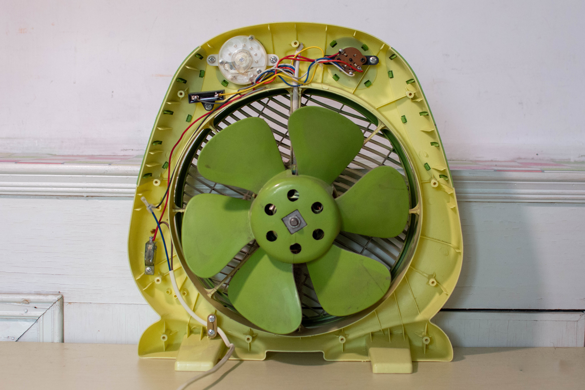
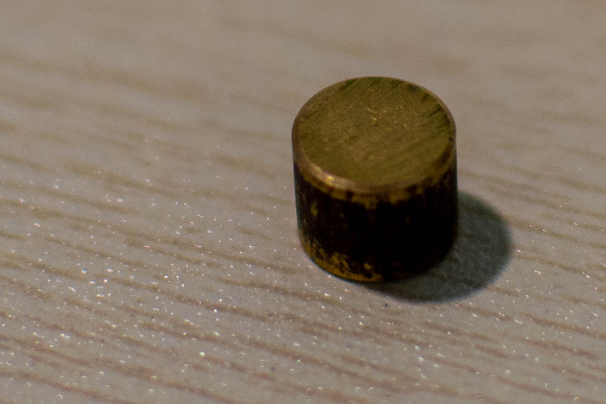
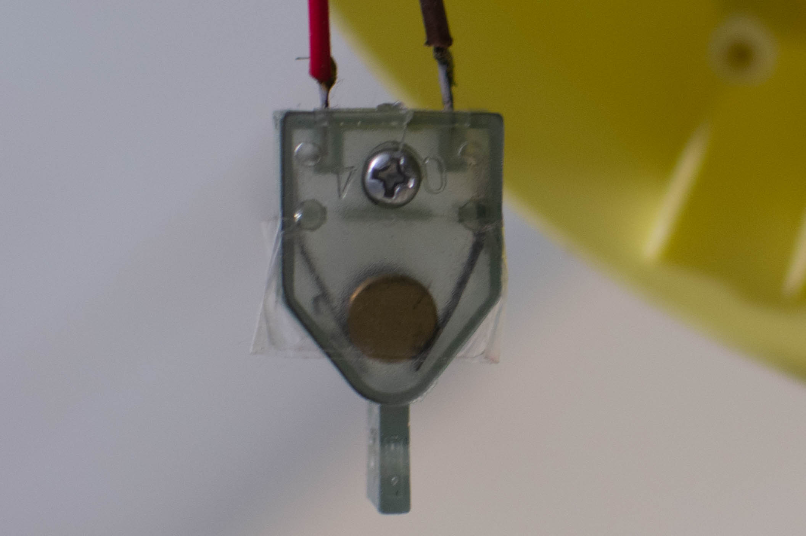

# Reverse Engineering and Repairing a Fan

Last summer, I broke a fan and managed to repair it. Although the repairing process is not so exciting, I recently find it can serve as a good example to explain a reverser's mindset. Like how I approached the problem and solved it. I hope to share some of my understanding about reverse engineering in this writeup. 

## A Broken Fan

I have a fan -- an eight-year-old fan -- that is NOT smart or IoT. It is just a simple fan. One day it fell from the table to the ground and stopped working. *RIP*. It accompanied me for several summers and I love it. I decided to take it apart and see what is indeed broken, before saying farewell to my friend. 

I know little about electronics, but a fan should not be too complex. It looks like this after I opened it: 

We can see the fan blades, the power cord, the timer, and the ON/OFF switch in it. It looks all in good shape despite the impact. How should I start reversing it? 

I quickly notice there is a small metal cylinder that is moving freely in the fan closure. Normally we do not have such small moving parts in a fan (it will clash with the blade easily). It is probably broken apart from the fan due to the impact. It is a reasonable guess. But how could I prove it or refute it? 

I decided to see other parts of the fan. The logic is, if the cylinder breaks apart from somewhere, there should be a trace of it. I then spotted a previously unnoticed part. It is a plastic box and there is a sharp irregular edge on it, which is a sign of a broken part. I have no idea what the box is and it does not look critical to the fan's functionality, since I already identified the timer and the switch, etc. 

## Making the Fan Alive Again! 

Upon closer inspection of the plastic box, I see two wires going into it and the wires are connected to small metal blades. One weird thing is the blades are **NOT** connected. And they are likely to remain unconnected during the operation of the fan. What is this? 

Now it becomes interesting: I have examined most parts of the fan, and found stuff that worth investigating. I need to connect the dots. Some creativity, as well as luck, are needed here. I stared at the plastic box and the cylinder for a while, and I suddenly **have a hypothesis**. If I put this metal cylinder inside the plastic box, the blades will be connected. Could it be the reason that the fan stopped working? 

I did a quick test: I put the cylinder inside it and turned the switch on. Wow, it works! The fan is alive again! 

## Why is there a Plastic Box and a Metal Cylinder? 

Not all of the mysteries are solved yet. I am still puzzled by this plastic box and the metal cylinder. What is the purpose of having them? What did they look like before the fall? 

Now it comes to the fundamental part of reverse engineering: **understanding how the system works**. The fan works but it is quite weird: this plastic box can be removed and we just connect the two wires directly. There must be a reason to have it. 

There are two ways to reason about it in such a situation. The first way is to think of what could go wrong if we do not have it. Like why we need to check whether the divisor is zero before we divide. However, as mentioned above, nothing seems wrong without this box. This method does not work here. It must be serving **certain purpose yet unknown** to us. This is quite a typical scenario in reverse engineering. 

The other way is to imagine different inputs to the system (the fan), and predict the possible status or outcomes of the system. Then we deduce the purpose of it. This is harder to do because we need to generate lots of inputs and examine many possible status or outcomes. And it is not guaranteed to succeed! It could be purposed for a situation we could never think of, so we would never know why it is here. 

Let us start with it. The cylinder currently connects the two metal blades. What would stop it from doing so? Not too hard, right? If it leaves the current position and goes up, the blades are disconnected. However, due to gravity, it will not move up by itself. Can we come up with a case where the gravity does not moderate this cylinder? Well, if this fan is used in the space station then the cylinder can move freely. But it is not the case here. It is a consumer product. What could be another case where the effect of gravity is gone or altered? 

**WHEN IT FALLS!**

When the fan falls, the gravity will no longer drag the cylinder toward the position that connects the two blades. The result is, the cylinder moves, leaving the two blads disconnected, and the fan stops working. Now we have a reasonable explanation for the plastic part and the metal cylinder: it is a **fall-protection mechanism**! 

## Connecting the Dots

Note the cylinder can not only move vertically, but it can also move horizontally. It can leave the plastic box and never (easily) get back. In fact, this is probably the cause of the fan's failure. We still miss something. 

I did not guess it, though some readers could already guessed it. I examined the fan again and found another plastic piece in it. It looks like a lid for the plastic box. If there is a lid, then the cylinder will not leave the plasitc box. And in case of the fan falls, once it is erected again, the cylinder will go back to its original position and connect the blades again. 

All the dots are eventually connected. The metal cylinder was confined in a plastic box. It serves as a fall protection mechanism. However, the fan fell from a high desk and the impact was so strong that the cylinder broke the plastic box apart. (We can see the lid was somehow connected to the box before it broke.) It is unable to go back to its original position again and the fan stopped working. 

I have to admit this is quite simple yet effective. If I were to implement such functionality, what comes to my mind first is gyroscopes and a program, which is both complex and expensive. Through reverse enginnering,  I learned the same thing can be achieved like this. 

It eventyally comes to the last step in reverse engineering. We need to repair the fan. For this particular one, it is not hard to repair. We first put the cylinder inside the box, then put the lid on top of the box, and then use some tape to secure it. It looks like this after it is repaired:

## Relating to Reverse Engineering

I admit this example of reverse engineering the fall-protection mechanism and repairing the fan is trivial. However, it does show some important steps in reverse engineering. Let me explain.

In the first step, I opened the fan to see its internal. This is analogous to analyzing a binary statically. I did some preliminary analysis on the fan, like identifying the core components. In reverse engineering, we do this too. Typically we would have a quick look at the binary to get some information about it. Like what platform it runs on and what API functions it calls. 

Then I spotted a metal cylinder that moves freely. This is called (by me) a **pivot**. A binary program can be huge and we cannot blindly reverse it entirely. We need to focus on something. It could be a string, an API function, or a constant value (in crypto function). 

From the cylinder, I investigated the fan and came up with a possible **hypothesis** for it. I tested it by putting the cylinder back and turn the fan on. Then the hypothesis is confirmed. This loop is quite common in real-world reverse engineering. For example, there is a function that we are not sure about. We could study it and get several possible guesses for it. Then we confirm or refute them. What I did is most close to **debugging**, where I launch the fan and see if it works. I am lucky since my first hypothesis is correct. In reversing this loop could repeat several times before one understands a complex function. 

Now it comes to the hard part. I did not immediately understand why there are such a plastic box and a cylinder. This is also common in reverse engineering. We encounter lots of things that we cannot properly understand or guess their meaning. The approach I took can be understood as a **symbolic execution** of the fan. I tried to reason about what could happen to the fan in a different scenario. While doing this, **constriant solving** is quite helpful as it gave me several cases of why the cylinder could move. Symbolic execution and constraint solving are intermediate topics in reverse engineering. They could look like *magic* in many cases. 

After I get a comprehensive understanding of the fan, I need to repair it. In reverse engineering, most likely we do not need to repair anything (well, in certain cases we need to fix a bug in the binary, but that is rare). We need to re-implement it, either as code or documentation. 

The above can be summarized in the following chart:

Repairing a fan | Reverse Enginnering
--- | --- | ---
take the fan apart | static analysis
spot the cylinder | find a pivot
guess the cylinder can connect the circuit | have a hypothesis
put the cylinder back and turn the fan on | test the hypothesis (debugging)
reason about the plastic box's functionality | symbolic execution & constraint solving
understand it is fall protection mechanism | understand the functionality of code
repair the fan | reimplement as code or documentation

Of course, this analogy is not meant to be complete or always accurate. For example, debugging is only one of the ways to test the hypothesis. And we do not explicitly use symbolic execution and constraint solving every time we reverse. An interesting fact is, when we reason about a piece of code, we probably symbolically executed it many times **in our mind** without using any external tools like Triton or angr. 