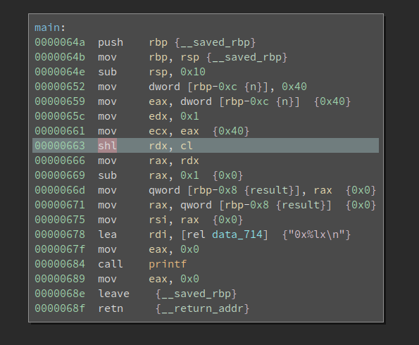
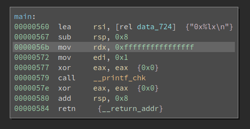
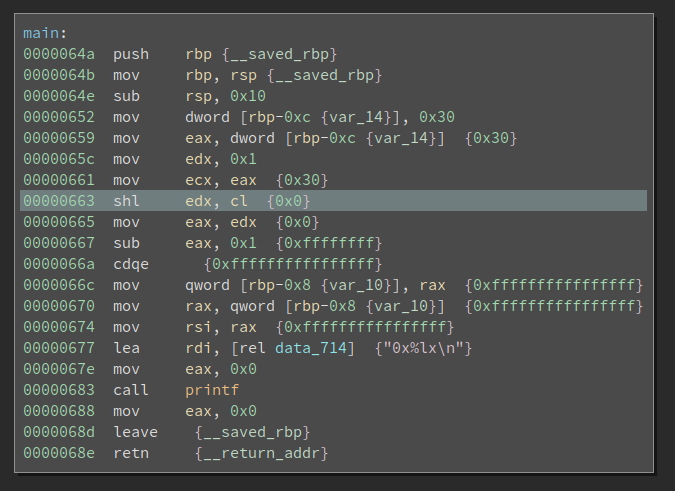

# Examining the difference between C program and Assembly -- An Example of << and shl

## Encountering a Weird Issue

Recently, I needed to write one function that returns a bitmask according to the number of bits. Basically, if the input is 8, it should return 0xff. The input `n` is in the range of 0-64 (both side include). 

The first idea is to use left shift and then minus 1:

```C
uint64_t getBitMask(size_t n)
{
    uint64_t ret = (1UL << n) - 1;
    return ret;
}
```

This works well when n is in the range of 0-63. However, when n is 64, the code returns 0 instead of 0xffffffffffffffff. 

I isolated the problem and created the following minimal PoC:

```C
#include <stdio.h>
#include <inttypes.h>

int main()
{
    int n = 64;
    uint64_t ret = (1UL << n) - 1;
    printf("0x%lx\n", ret);
}
```

And the command to compile and run it:

```
 $ gcc -o test test.c
 $ ./test
0x0
```

This result is counter-intuitive since when n is 64, the only bit in 1 should be shifted out and it becomes `0 - 1`, which should give me 0xffffffffffffffff. 

I have no idea why it behaves like this so I decided to load the compiled binary into BinaryNinja to see what is happening. 

## Assembly Never Lies



It looks correct to me. Completely confused, I launched gdb and see what is happening. It quickly turns out that after the `shl rdx, cl` at 0x663, rdx remains 0x1 rather than becoming 0. And 1 - 1 is 0 -- that is why 0x0 is printed. 

Some vague impression of the shl instruction struck me. `cl` is 64 now, which is also the size of the register being shifted. Does it affect the execution? I navigated to the Intel reference manual and start reading the page that documents the shl instruction. I found this: 

```
The count operand can be an immediate value or the CL register. The count is masked to 5 bits (or 6 bits if in 64-bit mode and REX.W is used). The count range is limited to 0 to 31 (or 63 if 64-bit mode and REX.W is used).
```

We are in 64-bit mode here. The documentation states that the bits beyond the lowest 6 are discarded. Now we have 64 (0b1000000) in cl, whose lowest 6 bits are zeros. No wonder rdx remains 1 after the shl -- we are effectively shifting 0 bit. 

Ok, things are sorted out now. But I decided to test how gcc handles this when optimizations are on. Because when we turn on optimization (e.g., -O2), it is very likely the value of `ret` is calculated by the compiler rather than in runtime. Does gcc also enforce the width limit on the shift count?

```
 $ gcc -O2 -o test_O2 test.c
 $ ./test_O2 
0xffffffffffffffff
```

Wow, the output is different from the previous one! And the disassembly looks like this:



The value 0xffffffffffffffff is directly printed. It same gcc -O2 behaves in the same way as I expected -- it ignores the limit on the shift count. 

Well, we now get one source code that gives different result when compiled with `-O0` and `-O2`. Is this a gcc bug? 

Nope, it is not. C standard actually defines the behavior as undefined: 

```
-- An expression is shifted by a negative number or by an amount greater than or equal to the width of the promoted expression (6.5.7).
```

Since this behavior is undefined, the difference between the `-O0` and `-O2` is not a bug. 

Back to the function I need to write, although there might be a way to implement the functionality without a branch, it probably exploits certain implementation of a particular compiler. Which is unreliable and bad for cross-platform and cross-compiler compatibility. I decided to put a `if` for the case `n == 64`. 

## Epilog

Differences between the C source code and the compiled x86 binary is an well-known issue. This paper comes to my mind first: [WYSINWYX:What You See Is Not What You eXecute](https://research.cs.wisc.edu/wpis/papers/wysinwyx.final.pdf). 

C is quite low level so it has a close relation with the underlying hardware. C standard defines certain behavior as undefined to save the effort of C compiler authors. If the `<<` operator is defined when the shift count is larger than or equal to the register width, there will be more branches in the compiler code to take care of many edge cases. 

Reading the assembly is probably the best method to resolve similar issues. In fact, during the development I once missed the `UL` after the constant `1`. And the code stops working after the n is larger than 32. 

```C
int main()
{
    int n = 48;
    uint64_t ret = (1 << n) - 1;
    printf("0x%lx\n", ret);
}
```

When the above code is compiled with `-O0`, it prints `0xffff`. Why? Because 1 is considered a 32-bit integer and gcc decides to use `edx` (instead of `rdx`) to hold it. 



Since 48 = 0b110000, and only the lowest 5 bits are involved in the calculation, we are effectively left shifting 16 bits. That is why we get 0xffff as the output. 

Last but not least, what would we get if we compile the above code with `-O2`? The result is surprising to me at first sight, followed by an aha moment. 

<!--  
$ ./test_missing_UL_O2 
0xffffffffffffffff
 -->