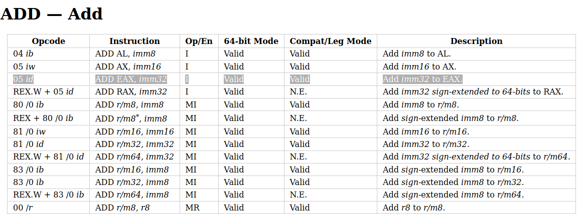

# Making and solving a Reversing Challenge Based-on x86 ISA Encoding

This time the writeup is a little bit different -- I am the maker of this challenge so the narrative is from a different perspective. I will first cover how I made it, and then show two possible ways to solve it. 

## The Plan

I have always been hoping to make some reversing challenges based-on the encoding of the x86 instruction set. It does not have to be super hard, maybe just explore some interesting aspects of the x86, which goes lower than the disassembly. Recently, thanks to my intern task that lifts x86 instructions, as well as reading this [blog post](https://www.msreverseengineering.com/blog/2015/6/9/x86-trivia-for-nerds), I decided to do it rather than set it for the future (indefinitely). 

There are several ways to do it, and I think it is not a bad idea to mutate the executable code according to the user input. It is interesting because, for most reversing challenges, the solver is not expected to change (patch) the code. However, we can take the user input and explicitly use it, in certain ways, to modify the code. 

So how do we do it? Executing the user input directly is probably not a good idea. Since code is typically non-printable, so the solution is going to be ugly. More importantly, when we grant the player with arbitrary code execution, it is hard to enforce that they solve it in our intended way. 

So it is best to modify existing code according to the user input. The first thing that came to my mind is we can do some arithmetics with it. We can have an equation like:

```
start_value ± a1 ± a2 ± .. ± an == result
```

Where the user has to figure out the correct plus or minus sign to make this equation correct. The `start_value`, `result`, as well as the `ai` (1 <= i <= n), are all randomly generated. I made them 32-bit integers. 

## Implementing and Automating

There are a couple of things to make the idea concrete. 

Firstly, how do we accept the user inputs? We can directly take plus or minus signs as string literals but I wish to make it slightly twisted here: the program will take a 32-bit integer and use each of its bits as the indicator of plus/minus. 

The next thing is about the x86 instruction encoding. I decided to use the register `eax` to hold the accumulated value and eventually compare it with the target value. We know that x86 instruction encodes the opcode in a straight-forward way, so it is quite easy to switch between an add instruction and sub instruction. 



If you look at the highlighted line, you will notice that `ADD EAX, imm32` is encoded as `05 id`, where the `05` stands for the opcode, and the `id` means a 32-bit immediate follows it. So if we have bytes `0512345678`, it will decode to `ADD EAX, 0x78563412` (note the endianess). Similarly, `SUB EAX, imm32` is encoded as `2D id`. So the real difference between an `ADD EAX, imm32` and a `SUB EAX, imm32` is the opcode, i.e., the first byte of the instruction. 

So the code modifying is easy: we just need to check every bit of the user input and overwrite the opcode byte of the correct one (05 or 2D). Each instruction is 5 bytes and the latter four bytes encode the immediate value in the equation. 

This challenge can be made manually, but I prefer to be able to generate it automatically. That brings several benefits, e.g., the ease of debugging during development. The source code of the challenge is provided in the [source folder](/source), and you can have a look at it. 

The code that does not change is written in C, whereas a Python script will generate random constant values for the changes and write it to a .h header file. the header file is included in the C source file so it can compile end-to-end. I also make a Makefile so I can easily build debug and release version of it. The Python generator looks like this:

```Python
import random
import os

rounds = 32
MAXINT = 0xffffffff

output = open('code.h', 'w')

val = random.randint(0, MAXINT)
# mov eax, val
output.write('{0xb8, 0x%x},\n' % val)
ans = 0

for i in range(rounds):
    op = random.randint(0, 1)
    round_val = random.randint(0, MAXINT)
    ans |= (op << i)
    if op == 0:
        val -= round_val
    else:
        val += round_val

    val &= MAXINT
    
    junk_opcode = random.randint(0, 0xff)
    output.write('{0x%x, 0x%x},\n' % (junk_opcode, round_val))

# cmp eax, val
output.write('{0x3d, 0x%x},' % val)
output.close()

print('the answer is: %d' % ans)
os.system('make')
```

The C source file defines a struct to describe the two particular instructions we are using:

```C
#pragma pack(1) 
typedef struct
{
    unsigned char opCode;
    uint32_t operand;
}instr;
```

The main.c is the core part of the challenge:

```C
#define N 32

instr code[]  __attribute__ ((section (".x86"))) = {
    #include "code.h"
    {0x0f, 0x9090d094},         
    // 00201043  0f94d0             sete    al  {0x1}
    // 00201046  90                 nop     
    // 00201047  90                 nop     
    {0xc3, 0}
    // 00201048  c3                 retn     {__return_addr}
};

int main()
{
    // read the input
    int input = 0;
    int unused = scanf("%d", &input);
    // modify the code according to the user input
    for(int i = 0; i < N; i ++)
    {
        bool bit = input & 1;
        input >>= 1;
        if (bit)
        {
            // add eax, imm32
            code[i + 1].opCode = 0x05;
        }
        else
        {
            // sub eax, imm32
            code[i + 1].opCode = 0x2d;
        }
    }
    // set page to executable
    void *page =
     (void *) ((unsigned long) (&code) &
        ~(getpagesize() - 1));
    mprotect(page, getpagesize(), PROT_READ | PROT_WRITE | PROT_EXEC);

    // call the code and check result
    bool (*func_ptr)() = (void*)&code;
    if (func_ptr())
    {
        printf("Well done!\n");
    }
    else
    {
        printf("Try again!\n");
    }
}
```

## Solving it with Z3

Now it is time to solve it. A dull brute-force solves it, though it could take a while to complete. The most straightforward idea is to use Z3. We create 32 booleans and transcribe the calculations into Z3 syntax. Of course, we need to extract those constant values, but it should be relatively easy. Then I get:

```Python
from z3 import *

# extracted from the challenge binary
init_val = 0x3df2f794
target_val = 0x7a612770
constants = [
    0x52ae22f2,
    0xbf409bcc,
    0x46417dc1,
    0x25f7d9a1,
    0xef83a7ce,
    0x2dd63e8e,
    0x584a1ec5,
    0x8e58e1df,
    0xf2705f70,
    0x2e94ef1e,
    0x3ca9e080,
    0xa617b5df,
    0x29ae9c3d,
    0x7461ed52,
    0x7125faac,
    0x65dfffd6,
    0x97f1f41c,
    0x6f4e0648,
    0xd803e5d0,
    0xf358f0eb,
    0xbc3b30c7,
    0x585685f8,
    0x2a9cc47c,
    0x7f03d175,
    0xc1d942ae,
    0x174c7d4f,
    0xb7d004f0,
    0xbec8b077,
    0x8ce8eaa2,
    0x2510e330,
    0x4aed0eee,
    0x4043cd91
]

# solver script
n = 32
inputs = [Bool('bit_%d' % i) for i in range(n)]

val = BitVecVal(init_val, 32)
for i in range(n):
    val = If(inputs[i], val + constants[i], val - constants[i])

s = Solver()
s.add(val == BitVecVal(target_val, 32))

if s.check() == sat:
    print('solved')
    m = s.model()
    solution = 0
    for i in range(n):
        bit = m.evaluate(inputs[i])
        if bit:
            solution |= (1 << i)
    print(solution)
else:
    print('failed')
```

It works but it is a little bit slow. It took 5 minutes to solve it, IIRC. The solution I get is:

```
$ python z3_solve.py 
solved
2371132652
```

And it works:

```
$ ./x86
2371132652
Well done!
```

Interestingly, the solution found by Z3 is different from the seed I used to generate the challenge, which is `1804139300`. But this is not surprising since there could exist other solutions than the original one. And I did not do anything to enforce the uniqueness of the challenge. 


## Solving it with Divide-and-Conquer

Z3 is good enough. However, there is another way to solve it. We can use divide-and-conquer to accelerate the brute-force. We can try the first 16 bits, which make up (2 ^ 16 = 65536) possibilities. We take note of the values we get. After that, we do the same thing for the latter 16 bits and do the same. Now we compare the two sets and compare if there are any matches. This allows us to find solutions in a faster way. Also, this can help us find ALL the solutions to this challenge. 

I am too lazy to do it by myself. I will leave it for interested readers!